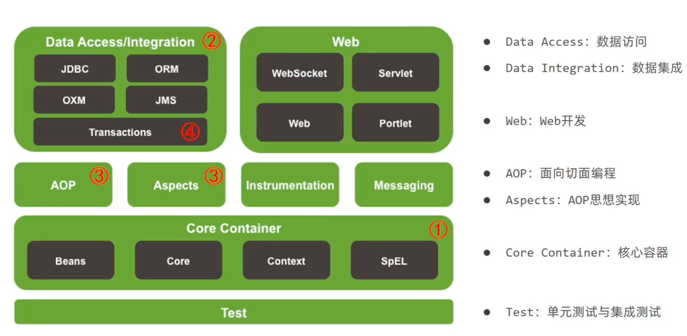
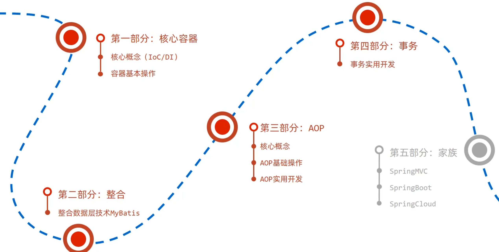
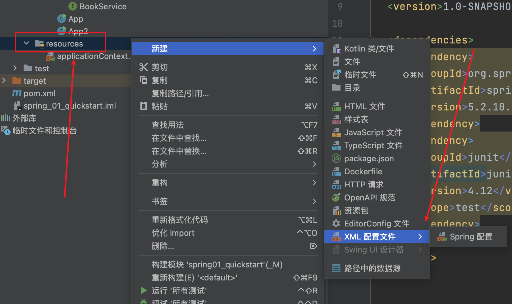

# SpringFramework

## SpringFramework系统架构

Spring Framework是Spring生态圈中最基础的项目，是其他项目的根基






## IoC 和 DI


为了解决： 使用对象时，在程序中不要主动使用 `new` 产生对象，转换为由外部提供对象

**IoC( Inversion of Contro1)控制反转 **：对象的创建控制权由程序转移到`外部`，这种思想称为控制反转

Spring技术对IoC思想进行了实现

- Spring提供了一个容器，称为`IoC容器`，用来充当IoC思想中的`外部`
- IoC容器负责对象的创建、初始化等一系列工作，被创建或被管理的对象在IoC容器中统称为 `Bean`

**DI( Dependency Injection )依赖注入**

- 在容器中建立 `bean` 与 `bean` 之间的依赖关系的整个过程，称为依赖注入


**充分解耦**

- 使用IoC容器管理bean (IoC)
- 在IoC容器内将有依赖关系的bean进行关系绑定(DI)最终效果
- 使用对象时不仅可以直接从IoC容器中获取，并且获取到的bean已经绑定了所有的依赖关系

## IoC入门

```xml
    <dependency>
      <groupId>org.springframework</groupId>
      <artifactId>spring-context</artifactId>
      <version>5.2.10.RELEASE</version>
    </dependency>
```





