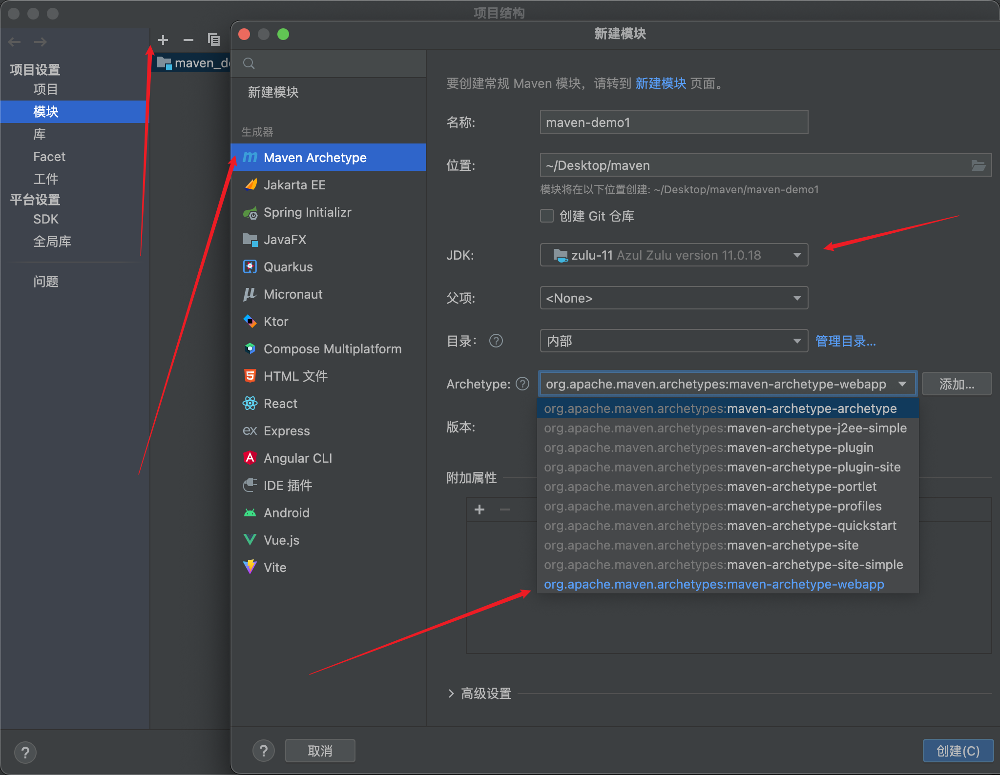
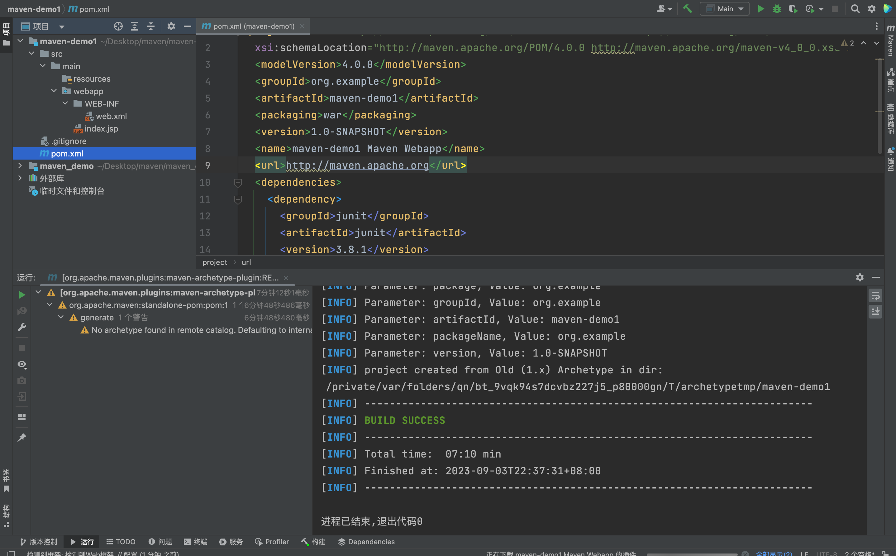
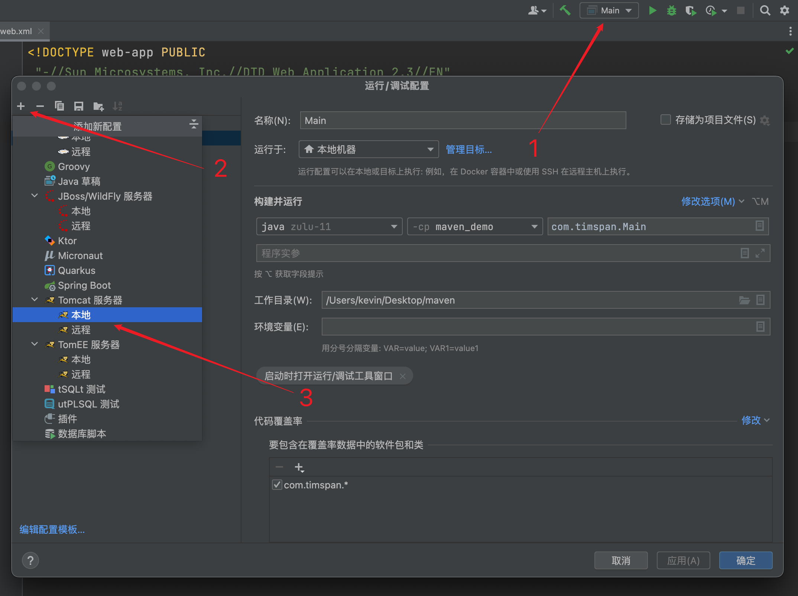
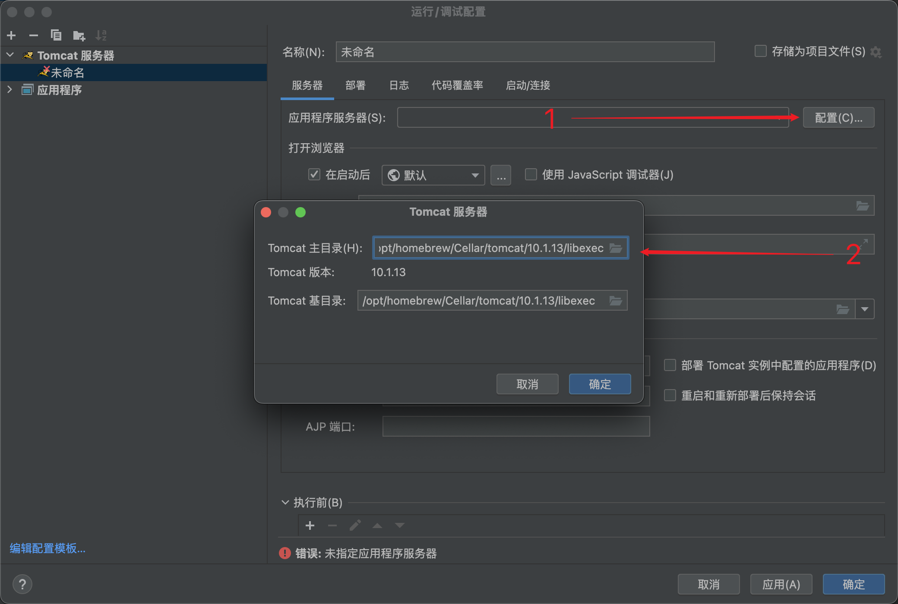
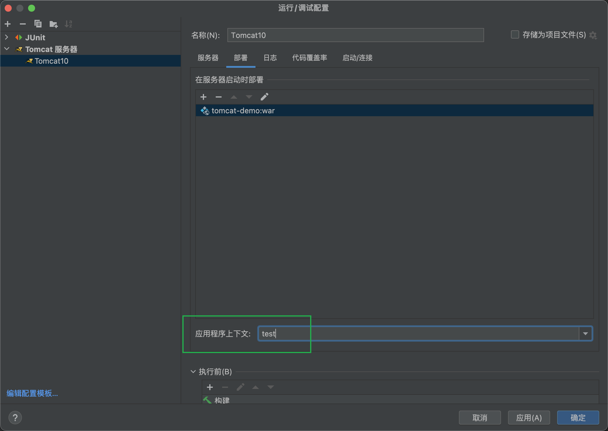
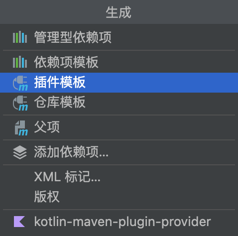

# Tomcat&Servlet

## Tomcat安装使用

https://tomcat.apache.org/

```shell
brew install tomcat
```

启动Tomcat：

```shell
brew services start tomcat
```

```http
http://localhost:8080
```

目录

```
/opt/homebrew/etc/tomcat
```

停止Tomcat：

```
brew services stop tomcat
```

重启Tomcat：

```
brew services restart tomcat
```

查看Tomcat状态：

```
brew services list
```


## 创建Maven Web项目

```
project-name
├── src
│   ├── main
│   │   ├── java
│   │   │   └── com
│   │   │       └── example
│   │   │           └── mywebapp
│   │   │               ├── controller
│   │   │               ├── model
│   │   │               ├── service
│   │   │               └── util
│   │   ├── resources
│   │   │   └── application.properties
│   │   └── webapp
│   │       ├── WEB-INF
│   │       │   ├── lib
│   │       │   ├── classes
│   │       │   └── web.xml
│   │       └── index.jsp
│   └── test
│       ├── java
│       │   └── com
│       │       └── example
│       │           └── mywebapp
│       │               └── controller
│       └── resources
├── target
├── pom.xml
└── README.md

```

- `src/main/java`：存放主要的Java源代码。
- `src/main/resources`：存放主要的资源文件，如配置文件。
- `src/main/webapp`：存放Web应用程序的静态资源和Web配置文件。
- `src/test/java`：存放测试用例的Java源代码。
- `src/test/resources`：存放测试用例的资源文件。
- `target`：存放构建生成的输出文件和目录。
- `pom.xml`：Maven项目的配置文件，包含项目的依赖和构建配置。
- `README.md`：项目的说明文档。

### 使用骨架创建

```


```


> 等待下载完之后项目就创建好了


## IDEA使用Tomcat

### 方式一：集成本地Tomcat

安装路径

```
/opt/homebrew/Cellar/tomcat/10.1.13/libexec
```

```


```


:::Tip

`注意这里的地址`

此时要访问 webapp 下的 a.html 

`http://localhost:8080/test/a.html`

:::

```


```


### 方式二：使用Tomcat Maven插件


```xml
    <plugins>
      <plugin>
        <groupId>org.apache.tomcat.maven</groupId>
        <artifactId>tomcat7-maven-plugin</artifactId>
        <version>2.2</version>
      </plugin>
    </plugins>
```


## Servlet

1. 创建 web项目，导入 Servlet依赖坐标

   - ```xml
         <dependency>
           <groupId>javax.servlet</groupId>
           <artifactId>javax.servlet-api</artifactId>
           <version>3.1.0</version>
           <scope>provided</scope>
         </dependency>
     ```

     

2. 创建: 定义一个类，实现 Servlet接口，并重写接口中所有方法，并在 service方法中输入一句话

   - ```js
     package com.TimSpan;
     
     import javax.servlet.*;
     import java.io.IOException;
     
     public class ServletDemo1 implements Servlet {
         public void service(ServletRequest servletRequest, ServletResponse servletResponse) throws ServletException, IOException {
             System.out.println("hello Servlet");
         }
     
         public void init(ServletConfig servletConfig) throws ServletException {
     
         }
     
         public ServletConfig getServletConfig() {
             return null;
         }
     
     
         public String getServletInfo() {
             return null;
         }
     
         public void destroy() {
     
         }
     }
     
     ```

3. 配置:在类上使用@WebServlet 注解，配置该 Servlet的访问路径

   - ```js
     @WebServlet("/demo1")
     public class ServletDemo1 implements Servlet{}
     ```

4. 访问:启动 Tomcat，浏览器输入URL 访问该Servlet


