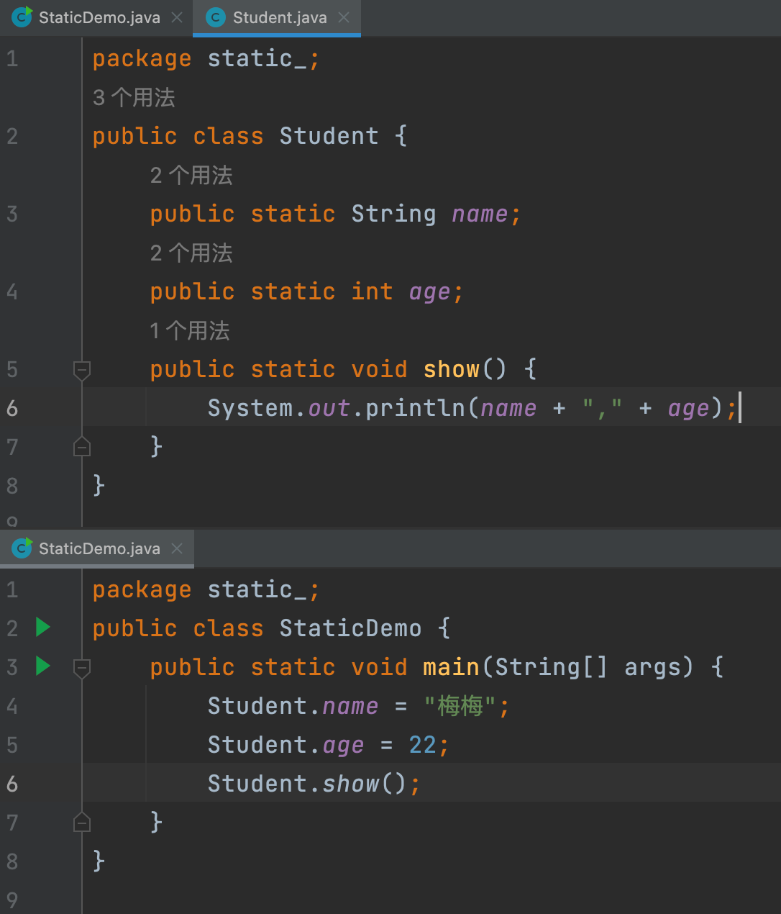
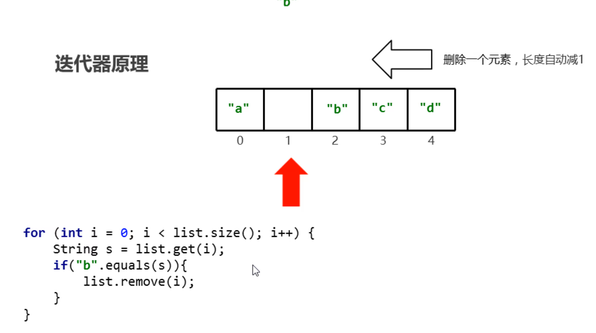

# Java Language

:::tip 你正在阅读我的 Java 文档

我过去的前端文档 [Docusaurus](https://timspan.gitee.io/myx/).
:::

## IDEA 代码结构：

项目，模块，包，类

### 新建模块


## 字面量：

|  字面量类型  |    说明    |  举例   |
| :----------: | :--------: | :-----: |
| 字符串字面量 | 双引号包裹 | "Hello" |
|  字符字面量  | 单引号包裹 |  'me'   |


```js
1.整型

类型              存储需求        bit数                  取值范围

byte              1字节           1*8                 －128～127

short             2字节           2*8               －32768～32767
int               4字节           4*8          （-2的31次方到2的31次方-1）
long              8字节           8*8          （-2的63次方到2的63次方-1）


2.浮点型

类型              存储需求         bit数                                  备注
float              4字节           4*8            float类型的数值有一个后缀F(例如：3.14F)
double             8字节           8*8         没有后缀F的浮点数值(如3.14)默认为double类型


3.char类型

类型              存储需求        bit数
char               2字节          2*8


4.boolean类型

类型              存储需求        bit数                  取值范围
boolean           1字节           1*8                 false、true
```

## 隐式转换：

```js
// 隐式转换
public class Main {
    public static void main(String[] args) {
        int a = 6;
        double b = 11.11;
        System.out.println(a + b);

        short aaa = 10;
        int bbb = 20;
        int ccc = aaa + bbb;
        System.out.println(ccc);
    }
}
```

## 强制转换：

```js
// 强制转换
public class Main {
    public static void main(String[] args) {
        int a = 6;
        double b = 11.11;
        System.out.println(a + b); // 17.11

        int c = (int) (a + b); //强制转换
        System.out.println(c); // 17
    }
}

// 强制转换有可能会丢失数据，所以一般不要去做强制转换
```


## 字符相加：

```js
public class Main {
    public static void main(String[] args) {
        //定义两个变量
        int i = 10;
        char ch = 'A';  // 'A'的值是65
        ch = 'a';       // a'的值是97
        ch = '0';       // 0的值是48
        System.out.println(i + ch);
    }
}
```

## ASCII 码表对照：

字符相加是拿计算机底层对应的数值来计算的

| ASCII 值 | 控制字符 | ASCII 值 | 控制字符 | ASCII 值 | 控制字符 | ASCII 值 | 控制字符 |
| :------- | :------- | :------- | :------- | :------- | :------- | :------- | :------- |
| 0        | NUT      | 32       | (space)  | 64       | @        | 96       | 、       |
| 1        | SOH      | 33       | !        | 65       | A        | 97       | a        |
| 2        | STX      | 34       | "        | 66       | B        | 98       | b        |
| 3        | ETX      | 35       | #        | 67       | C        | 99       | c        |
| 4        | EOT      | 36       | $        | 68       | D        | 100      | d        |
| 5        | ENQ      | 37       | %        | 69       | E        | 101      | e        |
| 6        | ACK      | 38       | &        | 70       | F        | 102      | f        |
| 7        | BEL      | 39       | ,        | 71       | G        | 103      | g        |
| 8        | BS       | 40       | (        | 72       | H        | 104      | h        |
| 9        | HT       | 41       | )        | 73       | I        | 105      | i        |
| 10       | LF       | 42       | \*       | 74       | J        | 106      | j        |
| 11       | VT       | 43       | +        | 75       | K        | 107      | k        |
| 12       | FF       | 44       | ,        | 76       | L        | 108      | l        |
| 13       | CR       | 45       | -        | 77       | M        | 109      | m        |
| 14       | SO       | 46       | .        | 78       | N        | 110      | n        |
| 15       | SI       | 47       | /        | 79       | O        | 111      | o        |
| 16       | DLE      | 48       | 0        | 80       | P        | 112      | p        |
| 17       | DCI      | 49       | 1        | 81       | Q        | 113      | q        |
| 18       | DC2      | 50       | 2        | 82       | R        | 114      | r        |
| 19       | DC3      | 51       | 3        | 83       | S        | 115      | s        |
| 20       | DC4      | 52       | 4        | 84       | T        | 116      | t        |
| 21       | NAK      | 53       | 5        | 85       | U        | 117      | u        |
| 22       | SYN      | 54       | 6        | 86       | V        | 118      | v        |
| 23       | TB       | 55       | 7        | 87       | W        | 119      | w        |
| 24       | CAN      | 56       | 8        | 88       | X        | 120      | x        |
| 25       | EM       | 57       | 9        | 89       | Y        | 121      | y        |
| 26       | SUB      | 58       | :        | 90       | Z        | 122      | z        |
| 27       | ESC      | 59       | ;        | 91       | [        | 123      | {        |
| 28       | FS       | 60       | <        | 92       | /        | 124      | \|       |
| 29       | GS       | 61       | =        | 93       | ]        | 125      | }        |
| 30       | RS       | 62       | >        | 94       | ^        | 126      | `        |
| 31       | US       | 63       | ?        | 95       | \_       | 127      | DEL      |

## 字符串相加：

```js
public class Main {
    public static void main(String[] args) {
        System.out.println("hello" + "world");
        System.out.println("hello" + 666);
        System.out.println(666 + "hello");
        System.out.println("hello" + 6 + 66);
        System.out.println(1 + 99 + "hello");
    }
}
```

输出结果：

```js
helloworld
hello666
666hello
hello666
100hello
```

:::tip 总结：

从左到右依次执行，

如果字符串先出现就连续的字符串拼接，

如果先出现数据相加，那就相加完，再拼接字符串

:::

## Function

定义

```js
public class Main {
    public static void main(String[] args) {
        test_();
    }
    public static void test_() {
        System.out.println("Hello world!");
    }
}
```

形参

```js
public class Main {
    public static void main(String[] args) {
        test_(6);
    }
    public static void test_(int a) {
        System.out.println("Hello world!    " + a);
        if (a == 6) {  //java 没有全等 ===
            System.out.println("你答对了");
        }
    }
}
```

返回值

**void** 表示没有 返回值

```js
 public static 返回值的数据类型 方法名(int a) {
        return a;
 }
```

```js
public class Main {
    public static void main(String[] args) {
        System.out.println(test_(6));
    }
    public static int test_(int a) {
        return a;
    }
}
```

## Function 重载

:::tip 满足下列条件的多个方法相互构成重载：

1. 多个方法在同一个类中
2. 多个方法具有相同的方法名
3. 多个方法的参数不相同，类型不同或者数量不同
4. 类型不同或者数量不同重载仅对应方法的定义，与方法的调用无关，调用方式参照标准格式
5. 重载仅针对同一个类中方法的名称与参数进行识别，与返回值无关，换句话说不能通过返回值来判定两个方法是否相互构成重载

:::

## IDEA

command + R 替换


## Object

创建对象格式：

```
类名 对象名 = new 类名( )
```

## 成员变量和局部变量

| 区别           | 成员变量                                   | 局部变量                                       |
| -------------- | ------------------------------------------ | ---------------------------------------------- |
| 类中位置不同   | 类中方法外                                 | 方法内或者方法声明上                           |
| 内存中位置不同 | 堆内存                                     | 栈内存                                         |
| 生命周期不同   | 随着对象的存在而存在，随着对象的消失而消失 | 随着方法的调用而存在，随着方法的调用完毕而消失 |
| 初始化值不同   | 有默认的初始化值                           | 没有默认的初始化值，必须先定义，赋值，才能使用 |

## private 关键字

:::tip private

1. 是一个权限修饰符
2. 可以修饰成员（成员变量 和 成员方法）
3. 作用是保护成员不被别的类使用，被 private 修饰的成员只在本类中才能访问

:::

针对 private 修饰的成员变量，如果需要被其他类使用，提供两个相应的操作:

1. 提供“**get 变量名()**”方法，用于获取成员变量的值，方法用 public 修饰
2. 提供“**set 变量名(参数)**”方法，用于设置成员变量的值，方法用 public 修饰

## JavaBean

就是一个 Java 中的类，其对象可以用于在程序中封装数据

:::tip 标准 JavaBean 须满足如下要求:

1. 成员变量使用 private 修饰
2. 提供每一个成员变量对应的 setXxx() / getXxx()
3. 提供一个无参构造方法

:::

##

## static 关键字

static 关键字是静态的意思，可以修饰成员方法，成员变量
static 修饰的特点：

1. 被类的所有对象共享，这也是我们判断是否使用静态关键字的条件 可以通过类名调用
2. 当然，也可以通过对象名调用，**推荐使用类名调用**

:::tip static 的访问特点

总结成一句话就是:**静态成员方法只能访问静态成员**

:::



##

## jar 包和帮助文档

- jar 包: 也就是后缀名为.jar 的文件，也叫做 jar 文件
- JAR 文件 (Java 归档，英语: JavaARchive)是一种软件包文件格式，一般情况下 jar 文件中打包了多个 class 文件
- 简单的理解: jar 包就是.class 文件的压缩包


### jar 包的使用

首先 这是我的 jar 包:

```js
/**
 * @author myx
 * @version 1.0
 */
public class ArrayTool {
    private ArrayTool() {
    }

    /**
     * 获取数组最大值
     *
     * @param arr 参数是一个数组
     * @return 返回数组最大值
     */
    public static int getMax(int[] arr) {
        int max = arr[0];
        for (int i = 0; i < arr.length; i++) {
            if (arr[i] > max) {
                max = arr[i];
            }
        }
        return max;
    }
}
```

首先把 jar 包拷贝到 lib 文件夹下面


使用；

```js
public class Main {
    public static void main(String[] args) {
        int arr_[] = {10, 100, 1000, 10000};
        int max = ArrayTool.getMax(arr_);
        System.out.println(max);
    }
}
```


### jar 包生成文档


-encoding UTF-8 -charset UTF-8

生成后的帮助文档：


## 多态概述：

指的是同一个对象，在不同时刻变现出来的多种形态


### 多态成员访问特点

多态中成员访问特点:

1. **成员变量**:编译看左边，执行看左边
2. **成员方法**:编译看左边，执行看右边

为什么成员变量和成员方法的访问不一样呢?

因为成员方法有重写，而成员变量没有


输出

```
40
猫吃鱼
```

### 多态的好处和弊端:

- 多态的好处:提高了程序的扩展性

  具体体现:定义方法的时候，使用父类型作为参数，将来在使用的时候，使用具体的子类型参与操作

- 多态的弊端:不能使用子类的特有功能


### 多态中的转型：

```js
/**
 * 向上转型:
 * 从子到父
 * 父类引用指向子类的对象
 * 向下转型:
 * 从父到子
 * 父类引用转为子类对象
 */
```


## 抽象类 abstract

在 Java 中，

一个没有方法体的方法应该定义为抽象方法，

而类中如果有抽象方法，该类必须定义为抽象类

简单演示：

抽象类和抽象方法必须使用 abstract 关键字修饰

```js
public abstract class Animal {
    public abstract void eat();
}
```

:::tip 抽象类的特点

- 抽象类中不一定有抽象方法，有抽象方法的类一定是抽象类
- 抽象类不能实例化
- 抽象类如何实例化呢?参照多态的方式，通过子类对象实例化，这叫抽象类多态抽象类的子类
- 要么重写抽象类中的所有抽象方法
- 要么是抽象类

:::


> **抽象类中的抽象方法的作用就是用来：限定子类必须完成某些动作**

### 抽象类成员特点

成员变量：

- 可以是变量
- 也可以是常量

构造方法：

- 有构造方法，但是不能实例化那么，构造方法的作用是什么呢?用于子类访问父类数据的初始化

成员方法：

- 可以有抽象方法:限定子类必须完成某些动作
- 也可以有非抽象方法:提高代码复用性

## 接口 interface

:::tip 接口的特点

- 接口用关键字`interface`修饰
- 类实现接口用`implements`表示
- 接口不能实例化，接口如何实例化呢?
  1. 参照多态的方式，通过实现类对象实例化，这叫接口多态
  2. 多态的形式:具体类多态，**抽象类多态**，**接口多态**
  3. 多态的前提:有继承或者实现关系，有方法重写，有父(类/接口)引用指向(子/实现)类对象

:::

### 类和接口关系

类和类的关系:

- 继承关系，只能单继承，但是可以多层继承

类和接口的关系

- 实现关系，可以单实现，也可以多实现，还可以在继承一个类的同时实现多个接口

接口和接口的关系

- 继承关系，可以单继承，也可以多继承

### 抽象类和接口的区别

:::tip **抽象类和接口的区别**

**成员区别：**

- 抽象类 变量，常量；有构造方法；有抽象方法，也有非抽象方法
- 接口 常量；抽象方法

**关系区别：**

- 类和类 继承，单继承
- 类和接口 实现，可以单实现，也可以多实现
- 接口和接口 继承，单继承，多继承

设计理念区别：

- 抽象类 对象抽象，包括属性、行为
- 接口 对行为抽象，主要是行为

:::


## JDK8 后接口新增方法:

接口的组成

- 常量 public static final
- 抽象方法 public abstract
- 默认方法(ava 8)
- 静态方法(ava 8)
- 私有方法(ava 9)

### 默认方法

格式:

```js
 public default 返回值类型 方法名(参数列表){ }
 范例:
 public default void show1() { }
```

### 静态方法

格式:

```js
public static 返回值类型 方法名(参数列表){ }
范例:
public static void show2() {}
```

:::tip 接口中静态方法的注意事项

静态方法只能通过接口名调用，不能通过实现类名或者对象名调用

public 可以省略，static 不能省略

:::

### 私有方法

```js
格式1: private 返回值类型 方法名(参数列表){ }
范例1: private void show3()
```

```js
格式2: private static 返回值类型 方法名(参数列表){ }
范例2: private static void show4() { }
```

## 内部类

内部类:就是在一个类中定义一个类。举例:在一个类 A 的内部定义一个类 B，类 B 就被称为内部类

:::tip 内部类的访问特点

- 内部类可以直接访问外部类的成员，包括私有
- 外部类要访问内部类的成员，必须创建对象

:::

```js
public class Outer {
    private int num = 10;

    public class Inner {
        public void show() {
            System.out.println(num);
        }
    }

    public void method_() {
        Inner i = new Inner();
        i.show();
    }
}


```

### 调用内部类：

```js
public class Outer {
    private int num = 10;

    public class Inner {
        public void show() {
            System.out.println(num);
        }
    }
}
```

```js
public class InnerDemo {
    public static void main(String[] args) {
//        创建内部类，并调用方法
//        此方法不常用
        Outer.Inner oi = new Outer().new Inner();
        oi.show();
    }
}
```

### 间接调用内部类：

```js
public class Outer {
    private int num = 10;

    private class Inner {
        public void show() {
            System.out.println(num);
        }
    }

    public void method_() {
        Inner i = new Inner();
        i.show();
    }
}

```

```js
public class InnerDemo {
    public static void main(String[] args) {
        Outer o = new Outer();
        o.method_();
    }
}

```

### 成员内部类

按照内部类在类中定义的位置不同，可以分为如下两种形式

- **在类的成员位置**:成员内部类
- **在类的局部位置**:局部内部类

### 局部内部类

- 局部内部类是在方法中定义的类，所以外界是无法直接使用，需要在方法内部创建对象并使用
- 该类可以直接访问外部类的成员，也可以访问方法内的局部变量

```js
public class Outer {
    private int num = 10;

    public void method_() {
        class Inner {
            public void show() {
                System.out.println(num);
            }
        }
        Inner i = new Inner();
        i.show();
    }
}
```

```js
public class InnerDemo {
    public static void main(String[] args) {
        Outer o = new Outer();
        o.method_();
    }
}
```

### 匿名内部类

前提:

存在一个类或者接口，这里的类可以是具体类也可以是抽象类

:::tip 本质:

**是一个继承了该类的子类匿名对象，或者是一个实现了该接口的实现类匿名对象**

:::

格式：


```js
Inter i = new Inter() {
            @Override
            public void show() {
                System.out.println("匿名内部类");
            }
        };
        i.show();
        i.show();
```

## Lambda 表达式

**函数式编程思想概述**:

- 在数学中，函数就是有输入量、输出量的一套计算方案，也就是“拿数据做操作'
- 面向对象思想强调“必须通过对象的形式来做事情”
- 函数式思想则尽量忽略面向对象的复杂语法:“强调做什么，而不是以什么形式去做”
- 而 Lambda 表达式就是函数式思想的体现

让我们先看看匿名内部类 如何实现：


再来看看 Lambda 表达式方式实现

```js
public class InterDemo {
    public static void main(String[] args) {
//        匿名内部类方式实现
        useInter(new Inter() {
            @Override
            public void show() {
                System.out.println("匿名内部类实现");
            }
        });
//        Lambda表达式方式实现
        useInter(() -> {
            System.out.println("Lambda表达式方式实现");
        });
    }

    public static void useInter(Inter i) {
        i.show();
    }
}
```

**带参数带返回值**

```js
public interface Inter {
    int add(int x, int y);
}
```

```js
public class InterDemo {
    public static void main(String[] args) {

//        重写抽象方法
        useInter((int x, int y) -> {
            int total = x + y;
            return total;
        });
    }

    public static void useInter(Inter i) {
        int sum = i.add(10, 20);
        System.out.println(sum);
    }
}

```

### Lambda 表达式省略模式

和 JavaScript 的箭头函数一样的

- 如果参数有且仅有一个，那么小括号也是可以省略的
- 如果代码块的语句只有一条，可以省略大括号和分号
- 如果代码块的语句只有一条，可以省略大括号和分号，如果有 return，return 也要省略

### Lambda 匿名内部类的区别

所需类型不同

- 匿名内部类: 可以是接口，也可以是抽象类，还可以是具体类
- Lambda 表达式: 只能是接口

使用限制不同

- 如果接口中仅有一个抽象方法，可以使用 Lambda 表达式，也可以使用匿名内部类
- 如果接口中多于一个抽象方法，只能使用匿名内部类，而不能使用 Lambda 表达式

实现原理不同

- 匿名内部类: 编译之后，产生一个单独的.class 字节码文件
- Lambda 表达式:编译之后，你没有看到一个单独的.class 字节码文件。对应的字节码会在运行的时候动态生成

## API_Math

```js
public class MathDemo {

    public static void main(String[] args) {
//        public static int abs ( int a)   返回参数的绝对值
        int abs = Math.abs(-10);
        System.out.println(abs);
//        public static double ceil(double a)   向上取整
//        public static int round(float a) 四舍五入
//        public static int max(int a,int b)返回两个int值中的较大值
//        public static int min(int a,int b)返回两个int值中的较小值
//        public static double pow(double a,double b)返回a的b次幂的值
//        返回值为double的正值，[0.9,1.0)public static double random()
    }
}

```

## API_System

System 类的常用方法

|                             方法名                              |                     说明                     |
| :-------------------------------------------------------------: | :------------------------------------------: |
|               public static void exit(int status)               | 终止当前运行的 Java 虚拟机，非零表示异常终止 |
|             public static long currentTimeMillis( )             |          返回当前时间(以毫秒为单位)          |
| **arraycopy(数据源数组,起始索引,目的地数组,起始索引,拷贝个数)** |                  数组 copy                   |

```js
public class System_ {
    public static void main(String[] args) {
        System.out.println(111);
        System.exit(0);
        System.out.println(222);  //不会打印
    }
}

```

```js
public class System_ {
    public static void main(String[] args) {
        int[] arr1 = {1, 2, 3, 4, 5};
        int[] arr2 = new int[10];
        System.arraycopy(arr1, 0, arr2, 0, arr1.length);
        for (int i = 0; i < arr2.length; i++) {
            System.out.println(arr2[i]);
        }
    }
}

输出：
1
2
3
4
5
0
0
0
0
0
```

## Object 类的概述

**每个类都可以将 Object 作为父类。所有类都直接或者间接的继承自该类**

为什么说子类的构造方法默认访问的是父类的无参构造方法 ?因为它们的顶级父类只有无参构造方法

### Object_toString

```js
public class Student {

    private String name;
    private int age;

    public Student(String name, int age) {
        this.name = name;
        this.age = age;
    }

    public String getName() {
        return name;
    }

    public void setName(String name) {
        this.name = name;
    }

    public int getAge() {
        return age;
    }

    public void setAge(int age) {
        this.age = age;
    }

    @Override
    public String toString() {
        return "Student{" +
                "name='" + name + '\'' +
                ", age=" + age +
                '}';
    }
}

```

```js
public class Demo {
    public static void main(String[] args) {
        Student s = new Student("myx", 26);
        System.out.println(s);
        System.out.println(s.toString());
    }
}

输出：
Student{name='myx', age=26}
Student{name='myx', age=26}

```

### Object_equals

|              方法名               |                            说明                            |
| :-------------------------------: | :--------------------------------------------------------: |
|     public String toString( )     | 返回对象的字符串表示形式。建议所有子类重写该方法，自动生成 |
| public boolean equals(另一个对象) | 比较对象是否相等。默认比较地址，重写可以比较内容，自动生成 |

接上面代码：

```js
public class Demo {
    public static void main(String[] args) {
        Student s1 = new Student("myx", 26);
        Student s2 = new Student("myx", 26);
        System.out.println(s1 == s2);
        System.out.println(s1.equals(s2));
    }
}
log:
false
false
分析：
首先 equals 被 s1 调用，但是 s1 内没有equals
这是我们 按住Command + B 去查看源码
源码中 也是用 == 去判断的
```


那么重写 equals 方法

按住 Command + N 选择 equals

然后下一步，一直点 next，直到 finish


```js
    @Override
    public boolean equals(Object o) {
        if (this == o) return true;
        if (!(o instanceof Student student)) return false;

        if (age != student.age) return false;
        return Objects.equals(name, student.name);
    }

    @Override
    public int hashCode() {
        int result = name != null ? name.hashCode() : 0;
        result = 31 * result + age;
        return result;
    }
```

重写过后属性值就是相等了

### equals 面试题

```js
public class InterviewTest {
    public static void main(String[] args) {
        String s1 = "abc";
        StringBuilder sb = new StringBuilder("abc");
        //1.此时调用的是string类中的equals方法
        // 保证参数也是字符串，否则不会比较属性值而直接返回false
        System.out.println(s1.equals(sb));
        //stringBuilder类中是没有重写equals方法，用的就是object类中的equals
        System.out.println(sb.equals(s1));
    }
}

```

## Objects 类

Objects 类的常用方法

| 方法名                                         | 说明                           |
| ---------------------------------------------- | ------------------------------ |
| public static String toString(对象)            | 返回参数中对象的字符串表示形式 |
| public static String toString(对象,默认字符串) | 返回对象的字符串表示形式       |
| public static Boolean isNull(对象)             | 判断对象是否为空               |
| public static Boolean nonNull(对象)            | 判断对象是否不为空             |

接 上面 Student 类代码

如果对象为 null，就会返回第二个参数

```js
public class Demo {
    public static void main(String[] args) {
//        Student s1 = new Student("myx", 26);
//        String res = Objects.toString(s1);
//        System.out.println(res);
        Student s = null;  //不 new 对象了
        String res = Objects.toString(s, "随便");
        System.out.println(res);

    }
}
log:
随便
```

## BigDecimal 构造

先来看一段代码

```js
public class BigDecimal_ {
    public static void main(String[] args) {
        System.out.println(10.0 / 3.0);
    }
}
log:
3.3333333333333335

```

可以看到 这个小数 3 没有一直打印下去

为什么呢？


> 虽然这样的误差很小，但是在一些金融，银行之类的 项目就不行

BigDecimal 类的**构造方法**

| 方法名                 | 说明          |
| ---------------------- | ------------- |
| BigDecimal(double val) | 参数为 double |
| BigDecimal(String val) | 参数为 String |

```js
				BigDecimal bd1 = new BigDecimal(10.0);
        BigDecimal bd2 = new BigDecimal("0.3");
        System.out.println(bd1);
        System.out.println(bd2);
        log:
        10
				0.3
```

### BigDecimal 四则运算

:::tip 常用方法

- add
- subtract
- multiply
- divide

:::

| 方法名                                             | 说明 |
| -------------------------------------------------- | ---- |
| public BigDecimal add(另一个 BigDecimal 对象)      | 加法 |
| public BigDecimal subtract(另一个 BigDecimal 对象) | 减法 |
| public BigDecimal multiply(另一个 BigDecimal 对象) | 乘法 |
| public BigDecimal divide(另一个 BigDecimal 对象)   | 除法 |

```js
        BigDecimal bd1 = new BigDecimal(0.1);
        BigDecimal bd2 = new BigDecimal(0.2);
        BigDecimal add = bd1.add(bd2);
        System.out.println(add);
        System.out.println(0.1 + 0.2);

log:
0.3000000000000000166533453693773481063544750213623046875
0.30000000000000004
```

我们会发现精度好像还是不太行

> 如果想要进行精度运算，得使用字符串的构造

```js
        BigDecimal bd1 = new BigDecimal("0.1");
        BigDecimal bd2 = new BigDecimal("0.2");
        log:
        0.3
```

### BigDecimal 特殊方法

先来看这一段代码：

报错了？

> 原因很简单，因为我们做的的精度计算，而 10.0 除以 3.0 是除不尽的


| public BigDecimal divide(另一个 BigDecimal 对象，精确几位，舍入模式) | 除法 |
| -------------------------------------------------------------------- | ---- |

```js
public class BigDecimal_ {
    public static void main(String[] args) {
        BigDecimal bd1 = new BigDecimal("10.0");
        BigDecimal bd2 = new BigDecimal("3.0");
        //参数一:表示参数运算的另一个对象
        //参数二:表示小数点后精确到多少位
        //参数三:舍入模式:
        // 进一法 BigDecimal.ROUND UP
        // 去尾法 BigDecimal.ROUND_FLOOR
        // 四舍五入 BigDecimal.ROUND_HALF_UP
        BigDecimal divide1 = bd1.divide(bd2, 2, BigDecimal.ROUND_UP);
        BigDecimal divide2 = bd1.divide(bd2, 2, BigDecimal.ROUND_FLOOR);
        BigDecimal divide3 = bd1.divide(bd2, 2, BigDecimal.ROUND_HALF_UP);
        System.out.println(divide1);  //3.34
        System.out.println(divide2);  //3.33
        System.out.println(divide3);  //3.33
    }
}
```

## API 文档

官网官方文档--英文的

菜鸟中文 11-- https://www.runoob.com/manual/jdk11api/index.html#

Java8：https://docs.oracle.com/javase/8/docs/api/

## GUI

Graphical User Interface(图形用户接口)

用图形的方式，来显示计算机操作的界面

java.awt 包:

Abstract Window ToolKit(抽象窗口工具包)，需要调用本地系统方法实现功能，属重量级控件

javax.swing 包:

在 awt 的基础上，建立的一套图形界面系统，提供了更多的组件，而且完全由 lava 实现。增强了移植性，属轻量级控件


## JFrame

**JFrame:**
是一个顶层窗口
**构造方法:**
JFrame(): 构造一个最初不可见的新窗体
**成员方法:**
void setVisible(boolean b): 显示或隐藏此窗体具体取决于参数 b 的值
void setSize(int width,int height): 调整此组件的大小，使其宽度为 width，高度为 height，单位是像素

```js
public class JFrame {
    public static void main(String[] args) {
        javax.swing.JFrame jf = new javax.swing.JFrame();
        jf.setVisible(true);
        jf.setSize(400, 300);
    }
}
```


成员方法

**void setTitle(String title):**

设置窗体标题

**void setLocationRelativeTo(Component c):**

设置位置，值为 null，则窗体位于屏幕中央

**void setDefaultCloseOperation(int operation):**

设置窗体关闭时默认操作

整数 3 表示:窗口关闭时退出应用程序

**void setAlwaysOnTop(boolean alwaysOnTop):**

设置此窗口是否应始终位于其他窗口之上

```js
public class JFrame {
    public static void main(String[] args) {
        javax.swing.JFrame jf = new javax.swing.JFrame();
        jf.setVisible(true);
        jf.setSize(400, 300);
        jf.setDefaultCloseOperation(3);
        jf.setTitle("hello myx");
        jf.setLocationRelativeTo(null);
        jf.setAlwaysOnTop(true);
    }
}

```

## JButton

构造方法

**JButton(String text):**

创建一个带文本的按钮
成员方法

**void setSize(int width, int height):**

设置大小 void setLocation(int x, int y): 设置位置(x 坐标 y 坐标)

## JLabel

短文本字符串或图像的显示区域
构造方法

**JLabel(String text):**

使用指定的文本创建 JLabel 实例

**JLabel(Icon image):**

使用指定的图像创建 JLabel 实例

- Imagelcon(String filename): 从指定的文件创建 Imagelcon

成员方法

**void setBounds(int x, int y, int width, int height):**

设置位置和大小

## Stringg 构造方法

```js
public class String_ {
    public static void main(String[] args) {
        String s1 = new String("hello");
        System.out.println(s1);
        System.out.println(s1.length());
        String s2 = new String("hello");
        String s3 = new String("Hello");
        System.out.println(s1.equals(s2)); //true
        System.out.println(s1.equals(s3)); //false
        System.out.println(s2.equalsIgnoreCase(s3)); //true
    }
}

```

## Stringg 成员方法

**int length():**

返回此字符串的长度

**boolean equals(Object anObject):**

将此字符串与指定的对象进行比较

**boolean equalslgnoreCase(String anotherString):**

将此 String 与另一个 String 比较，忽略了大小写

**String trim():**

返回一个字符串，其值为此字符串，删除了所有前导和尾随空格

## 基本类型包装类 Integer

**将基本数据类型封装成对象的好处就是可以通过对象调用方法操作数据**

**常用的操作之一:用于基本数据类型与字符串之间的转换**

| 基本数据类型 | 包装类型                           |
| ------------ | ---------------------------------- |
| byte         | java.lang.Byte（父类 Number）      |
| short        | java.lang.Short（父类 Number）     |
| int          | java.lang.Integer（父类 Number）   |
| long         | java.lang.Long（父类 Number）      |
| float        | java.lang.Float（父类 Number）     |
| double       | java.lang.Double（父类 Number）    |
| boolean      | java.lang.Boolean（父类 Object）   |
| char         | java.lang.Character（父类 Object） |

## Integer

Integer 类在对象中包装基本类型 int 的值
构造方法

**Integer(int value):**

根据 int 值创建 Integer 对象(过时)

**Integer(String s):**

根据 String 值创建 Integer 对象(过时)
成员方法

**static Integer valueOf(int i):**

返回表示指定的 int 值的 Integer 实例

**static Integer valueOf(String s):**

返回一个保存指定值的 Integer 对象 String

## Integer 类型转换

### Int 和 string 的相互转换

```js
public class Integer__ {
    public static void main(String[] args) {
//
        int number_ = 100;
        System.out.println(number_);
        Integer i1 = new Integer(100);
        Integer i2 = new Integer("100");
        Integer i3 = Integer.valueOf(100);
        System.out.println(i1);
        System.out.println(i2);
        System.out.println(i3);
//
//        第一种方法
        int num = 100;
        String s1 = num + "";
        System.out.println(s1);
//        第二种方法
        String s = "100";
        Integer i = Integer.valueOf(s);
        int number_m = i.intValue();
        System.out.println(number_m);
//        第三种方式
        int y = Integer.parseInt(s);
        System.out.println(number_m + "第三种方式");
    }
}
```

## SimpleDateFormat 格式化时间

构造方法

**SimpleDateFormat():**

构造一个 SimpleDateFormat，使用默认模式和日期格式

**SimpleDateFormat(String pattern):**

构造一个 SimpleDateFormat 使用给定的模式和默认的日期格式
格式化(从 Date 到 String )

**String format(Date date):**

将日期格式化成日期/时间字符串
解析(从 String 到 Date )

**Date parse(String source):**

从给定字符串的开始解析文本以生成日期

```js
import java.text.SimpleDateFormat;
import java.util.Date;

public class SimpleDateFormatDemo {
    public static void main(String[] args) {
        Date time = new Date();
        SimpleDateFormat format_ = new SimpleDateFormat();
        String s = format_.format(time);
        System.out.println(s);
    }
}
```

输出：

```
2023/7/28 22:41
```

```js
public class SimpleDateFormatDemo {
    public static void main(String[] args) {
        Date time = new Date();
        SimpleDateFormat format_ = new SimpleDateFormat("yyyy年MM月dd日 HH:mm:ss");
        String s = format_.format(time);
        System.out.println(s);
    }
}

```

输出：

```
2023年07月28日 22:44:00
```

```js
public class SimpleDateFormatDemo {
    public static void main(String[] args) throws ParseException {
//        Date time = new Date();
//        SimpleDateFormat format_ = new SimpleDateFormat("yyyy年MM月dd日 HH:mm:ss");
//        String s = format_.format(time);
//        System.out.println(s);

        String time = "2023-7-15 11:11:11";
        SimpleDateFormat format_ = new SimpleDateFormat("yyyy-MM-dd HH:mm:ss");
        Date newTime = format_.parse(time);
        System.out.println(newTime);
    }
}
```

输出:

```
Sat Jul 15 11:11:11 CST 2023
```

## 继承

**可以使得子类具有父类的属性和方法，还可以在子类中重新定义，追加属性和方法**

继承的好处和弊端

继承好处:

- 提高了代码的复用性(多个类相同的成员可以放到同一个类中)
- 提高了代码的维护性(如果方法的代码需要修改，修改一处即可)

继承弊端:

- 继承让类与类之间产生了关系，类的耦合性增强了，当父类发生变化时子类实现也不得不跟着变化，削弱了子类的独立性

## 继承中构造方法的访问特点

**子类中所有的构造方法默认都会访问父类中无参的构造方法**

为什么呢?

- 因为子类会继承父类中的数据，可能还会使用父类的数据。所以，子类初始化之前，一定要先完成父类数据的初始化
- 每一个子类构造方法的第一条语句默认都是: super()

**通过子类对象访问一个方法：**

1. 先子类成员范围找
2. 后父类成员范围找
3. 如果都没有就报错(不考虑父亲的父亲...)

### 方法重写

**子类中出现了和父类中一模一样的方法声明**
方法重写的应用：

当子类需要父类的功能，而功能主体子类有自己特有内容时，可以重写父类中的方法，这样，即沿袭了父类的功能又定义了子类特有的内容

### @Override

是一个注解

**可以帮助我们检查重写方法的方法声明的正确性**

下面不正确就报红了


## 权限修饰符

默认就是没有写修饰符

|  修饰符   | 同一个类中 | 同一个包中子类无关类 | 不同包的子类 | 不同包的无关类 |
| :-------: | :--------: | :------------------: | :----------: | :------------: |
|  private  |     ✅     |                      |              |                |
|   默认    |     ✅     |          ✅          |              |                |
| protected |     ✅     |          ✅          |      ✅      |                |
|  public   |     ✅     |          ✅          |      ✅      |       ✅       |

## final

**final 关键字是最终的意思，可以修饰成员方法，成员变量，类**

final 修饰的特点：

- 修饰方法:表明该方法是最终方法，**不能被重写**
- 修饰变量:表明该变量是**常量**，**不能再次被赋值**
- 修饰类:表明该类是最终类，**不能被继承**

### final 修饰局部变量

- 变量是基本类型:final 修饰指的是基本类型的**数据值**不能发生改变
- 变量是引用类型:final 修饰指的是引用类型的**地址值**不能发生改变，但是地址里面的内容是可以发生改变的

## 继承注意事项


## super

:::tip super

访问父类的成员变量

:::

```js
public class son extends father {
    public int age = 25;

    public void close() {
        int age = 20;
        System.out.println(age); //20
//        访问本类的成员变量
        System.out.println(this.age); //25
//
        System.out.println(super.age); //50
    }
}

```

super 关键字的用法和 this 关键字的用法相似

- **this**: 代表调用该方法的对象(一般我们是在当前类中使用 this，所以我们常说 this 代表本类对象的引用)
- **super**:代表父类存储空间的标识(可以理解为父类对象引用)

...表示可以有参数

| 关键字 | 访问成员变量                   | 访问构造方法               | 访问成员方法                        |
| ------ | ------------------------------ | -------------------------- | ----------------------------------- |
| this   | this.成员变量访问本类成员变量  | this( ...)访问本类构造方法 | this.成员方法(...)访问本类成员方法  |
| super  | super.成员变量访问父类成员变量 | super(...)访问父类构造方法 | super.成员方法(...)访问父类成员方法 |

## 数组

:::tip 数组

Java 中的数组必须先初始化,然后才能使用
所谓初始化:就是为数组中的数组元素分配内存空间，并为每个数组元素赋值

:::

数组初始化方式

1. 静态初始化
2. 动态初始化

### 静态初始化:

初始化时指定每个数组元素的初始值，由系统决定数组长度格式:

示例：

```js
public class array_ {
    public static void main(String[] args) {
        int[] arr_ = new int[]{10, 100, 1000};
//        简化写法
        int[] arr_2 = {10, 100, 1000};
        System.out.println(arr_2[0]);
        System.out.println(arr_2[1]);
        System.out.println(arr_2[2]);
    }
}

```

### 动态初始化:

初始化时只指定数组长度，由系统为数组分配初始值

```js
public class array_ {
    public static void main(String[] args) {
        int[] arr_ = new int[3];
        System.out.println(arr_[0]);
        System.out.println(arr_[1]);
        System.out.println(arr_[2]);

        arr_[0] = 10;
        arr_[1] = 100;
        arr_[2] = 1000;
        System.out.println(arr_[0]);
        System.out.println(arr_[1]);
        System.out.println(arr_[2]);
    }
}

```

输出

```
0
0
0
10
100
1000
```

### 二维数组

```js
public class arr_in_arr {
    public static void main(String[] args) {
        int[][] arr = {{1, 2, 3}, {10, 100, 1000}};
        System.out.println(arr[0][0]);
        System.out.println(arr[0][1]);
        System.out.println(arr[0][2]);
        System.out.println(arr[1][1]);
    }
}

```

## 数组高级操作

### 二分查找\_思想

:::tip 核心

1. 前提条件：有大小顺序
2. 思想：每次去掉一般的查找范围

:::

先来看基本查找


如果元素有大小顺序，我们就可以有更快的办法：

min 和 max 表示查找的范围


示例：现在要找 3，mid 等于 4

1.

1. 先判断 4 下标对应的元素 是不是 3，是？那就返回这个下标
1. 如果不是 3，那么就会判断 3 和 mid 对应元素的大小关系
1. 如果 3 比 mid 对应元素 小，那么就会判断 3 在左半边，右半边就不要了


然后重置范围继续查找，那么 max 就应该变了，变成 `mid - 1`，


最终找到了

那么，如果元素不存在呢？

数组的二分查找步骤：

1. 定义两个变量，表示要查找的范围。默认 min = 0，max = 最大索引
2. 循环查找，但是 min <= max
3. 计算出 mid 的值
4. 判断 mid 位置的元素是否为要查找的元素，如果是直接返回对应索引
5. 如果要查找的值在 mid 的左半边，那么 min 值不变，max = mid-1.继续下次循环查找
6. 如果要查找的值在 mid 的右半边，那么 max 值不变，min = mid + 1.继续下次循环查找
7. 当 min > max 时，表示要查找的元素在数组中不存在，返回-1

代码实现：

option + enter 快速创建方法


```js
public class erFen {
    public static void main(String[] args) {
        int[] arr_ = {1, 2, 3, 4, 5, 6, 7, 8, 9, 10};
        int number_ = 3;
        int index = searchForIndex(arr_, number_);
        System.out.println(arr_[index]);
    }
    private static int searchForIndex(int[] arr, int number) {
//        1、定义查找的范围
        int min = 0;
        int max = arr.length - 1;
//        2、循环查找 min < max
        while (min < max) {
//            3、计算出中间位置 mid
            int mid = (min + max) / 2;
//            int mid = (min + max) >> 1;
            if (arr[mid] > number) {
                max = mid - 1;
            } else if (arr[mid] < number) {
                min = mid + 1;
            } else {
                return mid;
            }
        }
        return -1;
    }
}

```

### 冒泡排序

## 递归

自己调用自己

求 1-100 的累加和

```js
public class recursion {
    public static void main(String[] args) {
        int sum = getSum(100);
        System.out.println(sum);
    }

    private static int getSum(int i) {
        if (i == 1) {
            return 1;
        } else {
            return i + getSum(i - 1);
        }
    }
}

```

## Arrays

Arrays 类包含用于操作数组的各种方法

| 方法名                                           | 说明                               |
| ------------------------------------------------ | ---------------------------------- |
| public static String toString(int[] a)           | 返回指定数组的内容的字符串表示形式 |
| public static void sort(intl] a)                 | 按照数字顺序排列指定的数组         |
| public static int binarySearch(int[] a, int key) | 利用二分查找返回指定元素的索引     |

```js
public class Arrays_ {
    public static void main(String[] args) {
        int[] arr_ = {1, 3, 4, 2, 5};
        System.out.println(Arrays.toString(arr_)); //[1, 3, 4, 2, 5]
        System.out.println(arr_); //[I@2a84aee7

        int[] arr_2 = {1, 3, 4, 2, 5};
        Arrays.sort(arr_2);
        System.out.println(Arrays.toString(arr_2)); //[1, 2, 3, 4, 5]

        int[] arr_3 = {1, 2, 3, 4, 5, 6, 7, 8, 9, 10};
        int index = Arrays.binarySearch(arr_3, 9);
        System.out.println(arr_3[index]);   //9
    }
}

```

## 异常

:::tip 异常

异常就是用来描述代码中出现的问题

异常:就是程序出现了不正常的情况。程序在执行过程中，出现的非正常的情况，最终会导致 JVM 的非正常停止

> 注意:语法错误不算在异常体系中。

:::


### 异常处理方式

```
throws 异常类名;
```

> **注意**: 这个格式是写在方法的定义处，表示声明一个异常.

```js
import java.text.ParseException;
import java.text.SimpleDateFormat;

public class throws_ {
    public static void main(String[] args) throws ParseException {
//        method1();
        method2();
    }

    private static void method2() throws ParseException {
        SimpleDateFormat sdf = new SimpleDateFormat("yyyy年MM月dd日");
        System.out.println(sdf.parse("2023年8月1日"));
    }

    private static void method1() throws NullPointerException {
        int[] arr = null;
        for (int i = 0; i < arr.length; i++) {
            System.out.println(arr[i]);
        }
    }
}
```

```js
public class throws_ {
    public static void main(String[] args) {
        System.out.println("hello");
        throw new RuntimeException();//当代码执行到这里，就创建一个异常对象
                                    // 该异常创建知哦吼，暂时没有手动处理，抛给了调用这处理
                                        //下面的代码就不会执行了
        System.out.println("world");
    }
}
```

**throws 和 throw 的区别:**

**throws**:

- 用在方法声明后面，跟的是异常类名
- 表示声明异常，调用该方法有可能会出现这样的异常

**throw**:

- 用在方法体内，跟的是异常对象名
- 表示手动抛出异常对象，由方法体内的语句处理

抛出处理异常的意义:

1. 在方法中，当传递的参教有误，没有继续运行下去的意义了，则采取抛出处理，表示让该方法结束运行
2. 告诉调用者方法中出现了问题

### try...catch 自己处理异常

```js
格式:
try {
	可能出现异常的代码
} catch(异常类名 变量名) {
	异常的处理代码
}
```

```js
public class try_catch {
    public static void main(String[] args) {
        int[] arr = null;
//        好处：能让代码继续运行
        try {
//            可能出现异常的代码
            printArr(arr);
        } catch (NullPointerException e) {
//            如果异常，我要做的操作
            System.out.println("参数不能为 null");
        }
        System.out.println("继续运行");
    }

    private static void printArr(int[] arr) {
        if (arr == null) {
            throw new NullPointerException();
        } else {
            for (int i = 0; i < arr.length; i++) {
                System.out.println(arr[i]);
            }
        }
    }
}
```

### try...catch 常见问题

1. 如果 try 中没有遇到问题，怎么执行 ?
2. 如果 try 中遇到了问题，那么 try 下面的代码还会执行吗 ?
3. 如果出现的问题没有被捕获，那么程序如何运行 ?
4. 同时有可能出现多个异常怎么处理 ?

### Throwable 的成员方法

| 方法名                          | 说明                              |
| ------------------------------- | --------------------------------- |
| public String getMessage( )     | 返回此 throwable 的详细消息字符串 |
| public String toString( )       | 返回此可抛出的简短描述            |
| public void printStackTrace ( ) | 把异常的错误信息输出在控制台      |

### finally

## 集合

```js
public class gather {
    public static void main(String[] args) {
        ArrayList<String> list = new ArrayList<>();
        list.add("1");
        list.add("2");
        list.add("3");
        System.out.println(list);
//        如果集合要存储基本数据类型，那么实际存储的是包装类
        ArrayList<Integer> list1 = new ArrayList<>();
        list1.add(1);
        list1.add(2);
        list1.add(3);
        System.out.println(list1);
    }
}

```


Collection 集合概述和使用
Collection 集合概述:

- 是单例集合的顶层接口，它表示一组对象，这些对象也称为 Collection 的元素
- JDK 不提供此接口的任何直接实现，它提供更具体的子接口(如 Set 和 List)实现

创建 Collection 集台的对象:

- 多态的方式
- 具体的实现类 ArrayList

### Collection 集合常用方法

| 方法名                     | 说明                               |
| -------------------------- | ---------------------------------- |
| boolean add(E e)           | 添加元素                           |
| boolean remove(Object o)   | 从集合中移除指定的元素             |
| boolean removeif(Obiect o) | 根据条件进行删除                   |
| void clear( )              | 清空集合                           |
| boolean contains(Object o) | 判断集合中是否存在指定的元素       |
| boolean isEmpty( )         | 判断集合是否为空                   |
| int size( )                | 集合的长度，也就是集合中元素的个数 |


option + command + m 抽取成方法


```js
package collection_;

import java.util.ArrayList;
import java.util.Collection;
import java.util.Collections;

public class collection_ {
    public static void main(String[] args) {
//        | 方法名                     | 说明                               |
//| -------------------------- | ---------------------------------- |
//| boolean add(E e)           | 添加元素                           |
//| boolean remove(Object o)   | 从集合中移除指定的元素             |
//| boolean removeIf(Object o) | 根据条件进行删除                   |
//| void clear( )              | 清空集合                           |
//| boolean contains(Object o) | 判断集合中是否存在指定的元素       |
//| boolean isEmpty( )         | 判断集合是否为空                   |
//| int size( )                | 集合的长度，也就是集合中元素的个数 |
        Collection<String> collection = new ArrayList<>();
        collection.add("aaa");
        collection.add("bbb");
        collection.add("ccc");
        collection.removeIf((String s) -> {
            return s.length() == 3;
        });
        System.out.println(collection); //[ ]


//        boolean result1 = collection.remove("aaa");
//        boolean result2 = collection.remove("ddd");
//        System.out.println(result1);
//        System.out.println(result2);
//        System.out.println(collection);

    }
}

```

### Collection 集合的遍历

Iterator: 迭代器，集合的专用遍历方式:

```
Iterator<E> iterator( ) : 返回集合中的迭代器对象，该迭代器对象默认指向当前集合的0索引
```

lterator 中的常用方法:

- boolean hasNext( ): 判断当前位置是否有元素可以被取出

- E next( ): 获取当前位置的元素

  ​ 将迭代器对象移向下一个索引位置

```js
public class collection_ {
    public static void main(String[] args) {
        Collection<String> collection = new ArrayList<>();
        collection.add("aaa");
        collection.add("bbb");
        collection.add("ccc");
//        1、获取迭代器对象
//        迭代器对象一旦被创建出来，默认指向集合的 0 索引处
        Iterator<String> it = collection.iterator();
//        利用迭代器里面的方法进行遍历
        System.out.println(it.hasNext()); //true
        System.out.println(it.next()); //aaa
        System.out.println(it.next()); //bbb

    }
}
```

```js
    public static void main(String[] args) {
        Collection<String> collection = new ArrayList<>();
        collection.add("aaa");
        collection.add("bbb");
        collection.add("ccc");
//        1、获取迭代器对象
//        迭代器对象一旦被创建出来，默认指向集合的 0 索引处
        Iterator<String> it = collection.iterator();
//        利用迭代器里面的方法进行遍历
//        System.out.println(it.hasNext()); //true
//        System.out.println(it.next()); //aaa
//        System.out.println(it.next()); //bbb
        while (it.hasNext()){   //如果有元素可以被取出，就调用
            System.out.println(it.next());
        }
    }
}
```

### Collection 迭代器远离分析


### Collection 迭代器删除方法

:::tip 集合特点

集合最大的特点是：

集合的长度可以自动的变长，也可以自动的变短

:::



如图：

当我们把这个元素删除后，集合的长度自动 - 1


后面的元素往前挪

```js
public class collection_ {
    public static void main(String[] args) {
        ArrayList<String> list = new ArrayList<>();
        list.add("a");
        list.add("b");
        list.add("b");
        list.add("c");
        list.add("d");
        for (int i = 0; i < list.size(); i++) {
            String s = list.get(i);
            if ("b".equals(s)){
                list.remove(i);
            }
        }
    }
}
```

改造以上代码：删除所有的 "b"

```js
public class collection_ {
    public static void main(String[] args) {
        ArrayList<String> list = new ArrayList<>();
        list.add("a");
        list.add("b");
        list.add("b");
        list.add("c");
        list.add("d");
        for (int i = 0; i < list.size(); i++) {
            String s = list.get(i);
            if ("b".equals(s)){
                list.remove(i);
//                只有在成功删除的时候 才让索引 自动减
                i--;
            }
        }
        System.out.println(list); //[a, c, d]
    }
}
```

另外一种方式

```js
public class collection_ {
    public static void main(String[] args) {
        ArrayList<String> list = new ArrayList<>();
        list.add("a");
        list.add("b");
        list.add("b");
        list.add("c");
        list.add("d");

        Iterator<String> it = list.iterator();
        while (it.hasNext()) {
            String s = it.next();
            if ("b".equals(s)) {
              	// 指向谁，就删除谁
                it.remove();
            }
        }
        System.out.println(list); //[a, c, d]
    }
}
```

### forEach

增强 for: 简化数组和 Collection 集合的遍历

- 它是 JDK5 之后出现的，其内部原理是一个 iterator 迭代器
- 实现 Iterable 接口的类才可以使用迭代器和增强 for

```js
public class collection_ {
    public static void main(String[] args) {
        ArrayList<String> list = new ArrayList<>();
        list.add("a");
        list.add("b");
        list.add("b");
        list.add("c");
        list.add("d");

//        可以理解为就是 js 的 forEach
//        str 就是集合的每一项
        for (String str : list) {
            System.out.println(str);
        }
    }
}

```

```js
public class collection_ {
    public static void main(String[] args) {
        ArrayList<String> list = new ArrayList<>();
        list.add("a");
        list.add("b");
        list.add("b");
        list.add("c");
        list.add("d");

//        可以理解为就是 js 的 forEach
//        str 就是集合的每一项
        for (String str : list) {
            str = "q";
            System.out.println(str); // qqqq
        }
        System.out.println(list); //[a, b, b, c, d]
    }
}
```


### 三种循环的使用场景

- 如果需要操作索引，使用普通 for 循环
- 如果在遍历的过程中需要删除元素，请使用迭代器
- 如果仅仅想遍历，那么使用增强 for

### List 集合

List 集合概述:

- 有序集合，这里的有序指的是存取顺序
- 用户可以精确控制列表中每个元素的插入位置。用户可以通过整数索引访问元素，并搜索列表中的元素
- 与 Set 集合不同，列表通常允许重复的元素

List 集合特点:

- 有序: 存储和取出的元素顺序一致
- 有索引:可以通过索引操作元素
- 可重复:存储的元素可以重复

```js
public class collection_ {
    public static void main(String[] args) {
        List<String> list = new ArrayList<>();
        list.add("a");
        list.add("b");
        list.add("b");
        list.add("c");
        list.add("d");
        Iterator<String> it = list.iterator();

        while (it.hasNext()) {
            String s = it.next();
            System.out.println(s);
        }
        for (String str : list) {
            System.out.println(str);
        }

    }
}
```

List 集合特有方法:

| 方法名                        | 说明                                   |
| ----------------------------- | -------------------------------------- |
| void add(int index,E element) | 在此集合中的指定位置插入指定的元素     |
| E remove(int index)           | 删除指定索引处的元素，返回被删除的元素 |
| E set(int index Eelement)     | 修改指定索引处的元素，返回被修改的元素 |
| E get(int index)              | 返回指定索引处的元素                   |

```js
public class collection_ {
    public static void main(String[] args) {
        List<String> list = new ArrayList<>();
        list.add("a");
        list.add("b");
        list.add("c");
        list.add("d");
        list.add(0, "qqq");
        System.out.println(list);//[qqq, a, b, c, d]
    }
}

```

```js
        String s = list.remove(0);
        System.out.println(s); //a
        System.out.println(list); //[b, c, d]
```

```js
        String s = list.set(0, "aaa");
        System.out.println(s); //a
        System.out.println(list); //[aaa, b, c, d]
```

```
        String s = list.get(0);
        System.out.println(s); //a
```

### ArrayList

前面用过，属于 list 集合

底层数据结构是数组，查询快，增删慢

### LinkedList

底层数据结构是链表，查询慢，增删快

LinkedList 集合的特有功能：

| 方法名                    | 说明                             |
| ------------------------- | -------------------------------- |
| public void addFirst(E e) | 在该列表开头插入指定的元素       |
| public void addLast(E e)  | 将指定的元素追加到此列表的末尾   |
| public E getFirst( )      | 返回此列表中的第一个元素         |
| public E getLast( )       | 返回此列表中的最后一个元素       |
| public E removeFirst( )   | 从此列表中删除并返回第一个元素   |
| public E removeLast( )    | 从此列表中删除并返回最后一个元素 |

### 泛型

泛型: 是 JDK5 中引入的特性，它提供了编译时类型安全检测机制
泛型的好处 :

- 把运行时期的问题提前到了编译期间
- 避免了强制类型转换

在 Java 中，泛型是一种强大的特性，它允许我们在编写代码时使用参数化类型。通过使用泛型，我们可以编写更加通用和可重用的代码，同时提高代码的类型安全性。

泛型的主要目的是在编译时提供类型检查，并在运行时消除类型转换的需要。它允许我们在类、接口和方法中定义一个或多个类型参数，这些类型参数可以在使用时被实际的类型替代。

下面是一些泛型的基本概念和用法：

1. 类型参数：在定义泛型类、接口或方法时，我们使用类型参数来表示未知的类型。类型参数可以是任何合法的标识符，通常使用单个大写字母来表示，比如`T、E、K`等。
2. 泛型类：通过在类名后面使用尖括号`<>`来指定类型参数，我们可以创建泛型类。例如，`ArrayList<T>`是一个泛型类，其中的`T`表示列表中的元素类型。
3. 泛型接口：与泛型类类似，我们也可以创建泛型接口。泛型接口的使用方式与泛型类相同。
4. 泛型方法：除了在类和接口中使用泛型，我们还可以在方法中使用泛型。通过在方法的返回类型前面使用类型参数，我们可以创建泛型方法。例如，`public <T> T` `getFirstElement(List<T> list)`是一个泛型方法，它返回给定列表的第一个元素。
5. 通配符：有时候我们可能不关心泛型的具体类型，只需要确保它是某个类型的子类型。在这种情况下，我们可以使用通配符?来表示未知类型。例如，`List<?>`表示一个未知类型的列表。

泛型的好处包括：

1. 类型安全：使用泛型可以在编译时捕获类型错误，避免在运行时出现类型转换异常。
2. 代码重用：通过使用泛型，我们可以编写更加通用的代码，可以在不同类型之间进行复用。
3. 简化代码：泛型可以减少代码中的重复和冗余，使代码更加简洁和易读。

总之，泛型是 Java 中一个强大的特性，它提供了类型安全和代码重用的好处。通过使用泛型，我们可以编写更加通用和灵活的代码，提高代码的可维护性和可扩展性。

### Set

:::tip 特点：

- 可以去除重复
- 存取顺序不一致
- 没有带索引的方法，所以不能使用普通 for 循环遍历，也不能通过索引来获取或者删除 Set 集合里面的元素

:::

### TreeSet

TreeSet 集台特点:

- 不包含重复元素的集合
- 没有带索引的方法
- **可以将元素按照规则进行排序**

**基本使用：**

```js
public class collection_ {
    public static void main(String[] args) {
        Set<String> list = new TreeSet<>();
        list.add("c");
        list.add("a");
        list.add("a");
        list.add("d");

//        Set 集合是没有索引的 ，所以不能使用通过索引获取元素的方法
        Iterator<String> s = list.iterator();
        while (s.hasNext()) {
            String str = s.next();
            System.out.println(str); //acd
        }
        for (String str : list) {
            System.out.println(str);//acd
        }
    }
}
```

```js
public class collection_ {
    public static void main(String[] args) {
        TreeSet<Integer> ts = new TreeSet<>();
        ts.add(5);
        ts.add(2);
        ts.add(1);
        ts.add(4);
        ts.add(3);
        System.out.println(ts); //[1, 2, 3, 4, 5]
    }
}
```

自然排序

:::tip 关键

​ 如果想使用 TreeSet，那必须指定排序的规则

:::

### Comparable 自然排序：

:::tip 步骤

- 使用`空参构造`创建 TreeSet 集合
- 自定义的 Student 类实现`Comparable`接口
- 重写里面的`compareTo`方法

:::

> 此接口对实现它的每个类的对象强加一个总排序。 这种排序被称为类的*自然顺序* ，类的`compareTo`方法被称为其*自然比较方法*

```js
public class Student implements Comparable<Student> {
    private String name;
    private int age;

    public Student(String name, int age) {
        this.name = name;
        this.age = age;
    }

    public String getName() {
        return name;
    }

    public void setName(String name) {
        this.name = name;
    }

    public int getAge() {
        return age;
    }

    public void setAge(int age) {
        this.age = age;
    }

    @Override
    public String toString() {
        return "Student{" +
                "name='" + name + '\'' +
                ", age=" + age +
                '}';
    }

    @Override
    public int compareTo(Student o) {
        int res = this.age - o.age;
        return res;
    }
}

```

```js
/**
 * TreeSet 集合存储 Student 类型
 */
public class TreeSet_2 {
    public static void main(String[] args) {
        TreeSet<Student> stu = new TreeSet<>();
        Student stu1 = new Student("毛xx", 26);
        Student stu2 = new Student("张xx", 22);
        Student stu3 = new Student("李xx", 20);
        stu.add(stu1);
        stu.add(stu2);
        stu.add(stu3);
        System.out.println(stu);
    }
}
```

自然排序简单原理图:

- 如果返回值为负数，表示当前存入的元素是较小值，存左边
- 如果返回值为 0，表示当前存入的元素跟集合中元素重复了，不存
- 如果返回值为正数，表示当前存入的元素是较大值，存右边

### Comparator 比较器排序

:::tip 步骤

- TreeSet 的带参构造方法使用的是`比较器排序`对元素进行排序的
- 比较器排序，就是`让集合构造方法接收Comparator的实现类对象`，重写 compare(To1,To2)方法
- 重写方法时，一定要注意排序规则必须按照要求的主要条件和次要条件来写

:::

| 构造器                                      | 描述                                                                             |
| :------------------------------------------ | :------------------------------------------------------------------------------- |
| `TreeSet()`                                 | 构造一个新的空树集，根据其元素的自然顺序进行排序。                               |
| `TreeSet(Collection<? extends E> c)`        | 构造一个新的树集，其中包含指定集合中的元素，并根据其元素的 _自然顺序进行排序_ 。 |
| `TreeSet(Comparator<? super E> comparator)` | 构造一个新的空树集，根据指定的比较器进行排序。                                   |
| `TreeSet(SortedSet<E> s)`                   | 构造一个包含相同元素并使用与指定有序集相同排序的新树集。                         |

接上面代码

```js
public class TreeSet_2 {
    public static void main(String[] args) {
        TreeSet<Student> stu = new TreeSet<>(new Comparator<Student>() {
            @Override
            public int compare(Student o1, Student o2) {
//                o1 表示要存入的那个元素
//                o2 表示已经存入到集合中的元素
                int res = o1.getAge() - o2.getAge();// 主要条件
                res = res == 0 ? o1.getName().compareTo(o2.getName()) : res; // 次要条件
                return res;
            }
        });
        Student stu1 = new Student("毛xx", 26);
        Student stu2 = new Student("张xx", 22);
        Student stu3 = new Student("李xx", 20);
        stu.add(stu1);
        stu.add(stu2);
        stu.add(stu3);
        System.out.println(stu);
    }
}
```

### HashSet

HashSet 集合特点：

- 底层数据结构是哈希表
- 不能保证存储和取出的顺序完全一致
- 没有带索引的方法，所以不能使用普通 for 循环遍历
- 由于是 Set 集合，所以元素唯一

```js
public class HashSet_ {
    public static void main(String[] args) {
        HashSet<String> hs = new HashSet();
        hs.add("hello");
        hs.add("world");
        hs.add("java");
        hs.add("java");
        Iterator<String> it = hs.iterator();
        while (it.hasNext()) {
            String s = it.next();
            System.out.println(s);
        }
        System.out.println("=====================");
        for (String s : hs) {
            System.out.println(s);

        }
    }
}
```

输出：

```
world
java
hello
=====================
world
java
hello
```

:::tip HashSet

HashSet 是 Set 体系下的，而 Set 又是 Collection 单列集合下面的

所以：HashSet 可以使用 Collection 里面所有的方法

> HashSet 底层是哈希表

哈希值(哈希码值 ) : 是 JDK 根据对象的地址或者属性值，算出来的 int 类型的整数
Object 类中有一个方法可以获取`对象的哈希值`

- `publicint hashCode0`: 根据对象的地址值计算出来的哈希值

对象的哈希值特点

- 如果没有重写 hashCode 方法，那么是根据对象的地址值计算出的哈希值.

:::

```js
import java.util.Objects;

public class Student implements Comparable<Student> {
    private String name;
    private int age;

    public Student(String name, int age) {
        this.name = name;
        this.age = age;
    }

    public String getName() {
        return name;
    }

    public void setName(String name) {
        this.name = name;
    }

    public int getAge() {
        return age;
    }

    public void setAge(int age) {
        this.age = age;
    }

    @Override
    public boolean equals(Object o) {
        if (this == o) return true;
        if (!(o instanceof Student student)) return false;

        if (age != student.age) return false;
        return Objects.equals(name, student.name);
    }

//    对 Object 类中的 hashCode 方法重写
//    重写之后，一般就根据对象的属性值来计算哈希值的
//    此时跟对象的地址值就没有任何关系了
    @Override
    public int hashCode() {
        int result = name != null ? name.hashCode() : 0;
        result = 31 * result + age;
        return result;
    }

    @Override
    public String toString() {
        return "Student{" +
                "name='" + name + '\'' +
                ", age=" + age +
                '}';
    }

    @Override
    public int compareTo(Student o) {
        int res = this.age - o.age;
        return res;
    }
}
```

```js
public class HashSet_ {
    public static void main(String[] args) {
        Student stu1 = new Student("毛xx", 26);
        Student stu2 = new Student("张xx", 22);
//      在 Object 类中，是根据对象的地址值计算出来的哈希值
        System.out.println(stu1.hashCode()); //168423058
        System.out.println(stu1.hashCode()); //168423058
        System.out.println(stu2.hashCode()); //821270929
    }
}

```

重写方法之后的输出值：

```
822678367
822678367
725589494
```

常见数据结构之哈希表：

哈希表

- JDK8 之前，底层采用数组+链表实现
- JDK8 以后，底层进行了优化。由数组+链表+红黑树实现

### HashSet-JDK7 底层原理解析

### HashSet-JDK8 底层优化

### Map

:::tip 单列和双列

- 单列集合一次存一个元素

- 双列集合一次存两个元素（也可以说是一对数据）

- ```js
  Interface Map<K,V>
  // K: 键的数据类型;V: 值的数据类型
  //首先 Map 是一个接口
  //一次添加两个元素，所以泛型也得写两个
  ```

:::

```js
import java.util.HashMap;
import java.util.Map;
public class Map_ {
    public static void main(String[] args) {
        Map<String, String> map = new HashMap<>();
        map.put("name", "毛玉香");
        map.put("age", "18");
        System.out.println(map); // {name=毛玉香, age=18}
    }
}
```

可以叫以下名字：

1. `键值对`
2. `键值对对象`
3. `Entry`


### Map 常用方法

| 方法名                              | 说明                                 |
| ----------------------------------- | ------------------------------------ |
| V put(K key,V value)                | 添加元素                             |
| V remove(Object key)                | 根据键删除`键值对`元素               |
| void clear( )                       | 移除所有的`键值对`元素               |
| boolean containsKey(Object key)     | 判断集合是否包含`指定的键`           |
| boolean containsValue(Object value) | 判断集合是否包含`指定的值`           |
| boolean isEmpty( )                  | 判断集合是否为空                     |
| int size( )                         | 集合的长度，也就是集合中键值对的个数 |

:::tip put 返回值

```js
public class Map_ {
    public static void main(String[] args) {
//        | 方法名                              | 说明                                 |
//| ----------------------------------- | ------------------------------------ |
//| V put(K key,V value)                | 添加元素                             |
//| V remove(Object key)                | 根据键删除`键值对`元素               |
//| void clear()                        | 移除所有的`键值对`元素               |
//| boolean containsKey(Object key)     | 判断集合是否包含`指定的键`           |
//| boolean containsValue(Object value) | 判断集合是否包含`指定的值`           |
//| boolean isEmpty()                   | 判断集合是否为空                     |
//| int size0                           | 集合的长度，也就是集合中键值对的个数 |
        Map<String, String> map = new HashMap<>();
        map.put("name", "毛玉香");
        map.put("age", "18");
//        如果要添加的键不存在，那么会把键值对添加到集合中
//        如果要添加的键存在，那么会覆盖原先的值，把原先值当做返回值进行返回
        String s = map.put("name", "张xx");
        System.out.println(s); //毛玉香
        System.out.println(map); //{name=张xx, age=18}
    }
}

```

:::

`remove`

```js
        String s = map.remove("name");
        System.out.println(s);//毛玉香
        System.out.println(map); //{age=18}
```

`clear`

```js
map.clear();
输出 { }
```

```js
        boolean res1 = map.containsKey("name");
        boolean res2 = map.containsValue("19");
        System.out.println(res1);//true
        System.out.println(res2);//false
```

### Map 的两种遍历方式

#### 第一种

Map 集合的获取功能

| 方法名             | 说明             |
| ------------------ | ---------------- |
| `Set<K> keySet( )` | 获取所有键的集合 |
| V get(Objectkey)   | 根据键获取值     |

```js
import java.util.HashMap;
import java.util.Map;
import java.util.Set;
public class Map_ {
    public static void main(String[] args) {
        Map<String, String> map = new HashMap<>();
        map.put("名字", "毛xx");
        map.put("身份证", "3624123199702010000");
        map.put("性别", "男");
        map.put("手机", "17346625366");
//        获取到所有的键
        Set<String> keys = map.keySet();
//        遍历 Set 集合的每一个键
        for (String key : keys) {
            String val = map.get(key); //通过每一个键key，获取到对应的值
            System.out.println(key + ":" + val);
        }
    }
}
```

```js
名字: 毛xx
手机: 17346625366
身份证: 3624123199702010000
性别: 男
```

#### 第二种

| 方法名                          | 说明                     |
| ------------------------------- | ------------------------ |
| Set<Map.Entry<K,V>> entrySet( ) | 获取所有键值对对象的集合 |
| K getKey( )                     | 获得键                   |
| V getValue( )                   | 获得值                   |

```js
public class Map_ {
    public static void main(String[] args) {
        Map<String, String> map = new HashMap<>();
        map.put("名字", "毛xx");
        map.put("身份证", "3624123199702010000");
        map.put("性别", "男");
        map.put("手机", "17346625366");
//        1、首先要获取到所有的键值对对象
//        2、Set集合中装的是键值对对象（Entry对象）
//        3、而 Entry 里面装的是键和值
        Set<Map.Entry<String, String>> entries = map.entrySet();
        for (Map.Entry<String, String> entry : entries) {
//            得到每一个键值对对象
            String key = entry.getKey();
            String value = entry.getValue();
            System.out.println(key + ":" + value);
        }
    }
}

```

### HashMap

### TreeMap

### 可变参数

可变参数: 就是形参的个数是可以变化的

- 格式 : 修饰符返回值类型 方法名(数据类型...变量名)[}
- 范例 : public static int sum(int... a) { }

可变参数注意事项：

> 这里的变量其实是一个数组

```js
public class variable_element {
    public static void main(String[] args) {
        int res = getSum(1, 2, 3, 4, 5);
        System.out.println(res); //15
    }

    public static int getSum(int... arr) {
        int sum = 0;
        for (int i = 0; i < arr.length; i++) {
            sum = sum + arr[i];
        }
        return sum;
    }
}

```

```js
public class variable_element {
    public static void main(String[] args) {
        int res = getSum(1, 2, 3, 4, 5);
        System.out.println(res); //15
    }

    public static int getSum(int number, int... arr) {
        int sum = 0;
        for (int i = 0; i < arr.length; i++) {
            sum = sum + arr[i];
        }
        return sum;
    }
}
```

### 创建不可变集合

| 方法名                                      | 说明                                 |
| ------------------------------------------- | ------------------------------------ |
| `static <E> List<E> of(E...elements)`       | 创建一个具有指定元素的 Map 集合对象  |
| `static <E> Set<E> of(E...elements)`        | 创建一个具有指定元素的 List 集合对象 |
| `static <K, V> Map<K , V> of(E...elements)` | 创建一个具有指定元素的 Set 集合对象  |

## Stream 流

体验 Stream 流

需求: 按照下面的要求完成集合的创建和遍历

- 创建一个集合，存储多个字符串元素
- 把集合中所有以“张”开头的元素存储到一个新的集合
- 把“张"开头的集合中的长度为 3 的元素存储到一个新的集合
- 遍历上一步得到的集合

传统方式：

```js
public class MyStream {
    public static void main(String[] args) {
//        集合的批量添加
//        传统方式：
        ArrayList<String> list = new ArrayList<>(List.of("张三丰", "张无忌", "张翠山", "王二麻子", "谢xx"));
        ArrayList<String> list2 = new ArrayList<>();
        for (String s : list) {
            if (s.startsWith("张")) {
                list2.add(s);
            }
        }
        ArrayList<String> list3 = new ArrayList<>();
        for (String s : list2) {
            if (s.length() == 3) {
                list3.add(s);
            }
        }
        for (String s : list3) {
            System.out.println(s);
        }
    }
}
```

```js
//        Stream方式：
        list1.stream().filter(s -> s.startsWith("张"))
                .filter(s -> s.length() == 3)
                .forEach(s -> System.out.println(s));
```

Stream 流的三类方法
获取 Stream 流

- 创建一条流水线，并把数据放到流水线上准备进行操作

中间方法

- 流水线上的操作。一次操作完毕之后，还可以继续进行其他操作

终结方法

- 一个 Stream 流只能有一个终结方法是流水线上的最后一个操作

### Stream 流的获取方法

- **单列集合**

  ```
  可以使用Collection接口中的默认方法stream()生成流
  default Stream<E> stream()
  ```

  ```js
  public class MyStream_2 {
      public static void main(String[] args) {
          ArrayList<String> list = new ArrayList<>();
          list.add("aaa");
          list.add("bbb");
          list.add("ccc");
  //        Stream<String> stream = list.stream();
  //        stream.forEach(s -> System.out.println(s));
          list.stream().forEach(s -> System.out.println(s));
      }
  }
  ```

- **双列集合**

  ```
  间接的生成流
  可以先通过keySet或者entrySet获取一个Set集合，再获取Stream流
  ```

  keySet

  ```js
  public class MyStream_2 {
      public static void main(String[] args) {
          HashMap<String, Integer> hm = new HashMap<>();
          hm.put("李xx", 23);
          hm.put("张xx", 23);
          hm.put("毛xx", 23);
          hm.put("曾xx", 23);
  //        双列集合不能直接获取 Stream 流
  //        keySet
  //        先获取所有的键
  //        再把这个 Set 集合中所有的键放到 Stream 流中
          hm.keySet().stream().forEach(s -> System.out.println(s));//打印所有的键
      }
  }

  ```

  entrySet

  ```
  hm.entrySet().stream().forEach(s -> System.out.println(s));
  ```

  输出：

  ```
  张xx
  曾xx
  李xx
  毛xx
  张xx=23
  曾xx=23
  李xx=23
  毛xx=23
  ```

- **数组**

  ```
  Arrays中的静态方法stream生成流
  ```

  ```js
          int[] arr = {1, 2, 3, 4, 5};
          Arrays.stream(arr).forEach(s -> System.out.println(s));
  ```

- **同种数据类型的多个数据**

  ```
  1 , 2 , 3 , 4 , 5...
  "aaa"，"bbb"，"ccc
  使用Stream.of(T...values)生成流
  ```

  ```js
  //        同种数据类型的多个数据
          Stream.of(1, 2, 3, 4, "你好").forEach(s -> System.out.println(s));
  ```

### Stream 流的中间方法 filter

和 JavaScript 数组的 filter 差不多，用法前面演示过

### Stream 流的常见中间操作方法

- `Stream<T> limit(long maxSize):`截取指定参数个数的数据
- `Stream<T> skip(long n):` 跳过指定参数个数的数据
- `static <T>Stream<T> concat(Stream a, Stream b):`合并 a 和 b 两个流为一个流
- `Stream<T> distinct():`去除流中重复的元素。依赖(hashCode 和 equals 方法)

limit

```js
public class MyStream {
    public static void main(String[] args) {
        ArrayList<String> list1 = new ArrayList<>(List.of("张三丰", "张无忌", "张翠山", "王二麻子", "谢xx"));
        list1.stream().limit(2).forEach(s -> System.out.println(s));
//        这个截取指的是保留前面的数据
//        输出：
//        张三丰
//        张无忌
    }
}
```

skip

```js
list1.stream().skip(2).forEach(s -> System.out.println(s));
// 跳过前面的
输出：
张翠山
王二麻子
谢xx
```

concat

```js
import java.util.ArrayList;
import java.util.List;
import java.util.stream.Stream;
public class MyStream {
    public static void main(String[] args) {
        ArrayList<String> list1 = new ArrayList<>(List.of("张三丰", "张无忌", "张翠山", "王二麻子", "谢xx"));
        ArrayList<String> list2 = new ArrayList<>(List.of("张三丰", "张无忌", "张翠山", "王二麻子", "谢xx"));
        Stream<String> stream1 = list1.stream();
        Stream<String> stream2 = list2.stream();
        Stream<Object> stream3 = Stream.concat(stream1, stream2);
        stream3.forEach(s -> System.out.println(s));
    }
}
```

distinct

```js
public class MyStream {
    public static void main(String[] args) {
        ArrayList<String> list1 = new ArrayList<>(List.of("张三丰", "张无忌", "张翠山", "王二麻子", "谢xx", "谢xx", "谢xx", "谢xx"));
        list1.stream().distinct().forEach(s -> System.out.println(s));
    }
}
输出：
张三丰
张无忌
张翠山
王二麻子
谢xx
```

### Stream 流的 终结方法

void forEach(Consumeraction):对此流的每个元素执行操作

- Consumer 接口中的方法
- void accept(Tt): 对给定的参数执行此操作

long count( ): 返回此流中的元素数

```js
public class MyStream {
    public static void main(String[] args) {
        ArrayList<String> list1 = new ArrayList<>(List.of("张三丰", "张无忌", "张翠山", "王二麻子", "谢xx"));
//        在 forEach 方法的底层，会循环获取到流中的每一个数据
//        并循环调用 accept 方法，病吧每一个数据传递给 accept 方法
//        s 就依次表示了流中的每一个数据
//        所以，我们只需要在 accept 方法中，写上处理的业务逻辑就可以了
        list1.stream().forEach(
                new Consumer<String>() {
                    @Override
                    public void accept(String s) {
                        System.out.println(s);
                    }
                }
        );
    }
}
```

简写

```js
list1.stream().forEach(s -> System.out.println(s));
```

:::tip 结论:

在 Stream 流中无法直接修改集合,数组等数据源中的数据

:::

### Stream 流的 收集操作

使用 Stream 流的方式操作完毕之后，我想把流中的数据起来，该怎么办呢 ?
Stream 流的收集方法

- R collect(Collector collector)

工具类 Collectors 提供了具体的收集方式

- `public static <T> Collector toList()` : 把元素收集到 List 集合中
- 到 Set 集合中`public static <T> Collector toSet()` : 把元素收集
- `public static CollectortoMap(Function keyMaper,FunctionvalueMapper)`:把元素收集到 Map 集合中

```js
import java.util.ArrayList;
import java.util.List;
import java.util.stream.Collectors;
public class MyStream {
    public static void main(String[] args) {
//        Stream流的 收集操作
//        定义集合，添加 1-10
//        奇数删除，暴漏偶数
//        遍历得到 2，,4，,6，,8，,10
        ArrayList<Integer> list = new ArrayList<>();
        for (int i = 1; i <= 10; i++) {
            list.add(i);
        }
//        Collectors.toList()：在底层会创建一个 List 集合，并把所有的数据添加到 List 集合中
//        collect方法会返回一个集合
        List<Integer> newList = list.stream().filter(number -> number % 2 == 0).collect(Collectors.toList());
        System.out.println(newList);
        Set<Integer> newSet = list.stream().filter(number -> number % 2 == 0).collect(Collectors.toSet());
        System.out.println(newSet);
    }
}

```

## File 和 IO

:::tip 什么是 File 和 IO

IO 可以对硬盘中的文件进行读写

File 表示要读写的文件在哪，也可以对文件进行创建，删除等操作

IO 流是什么 ?

1. 可以将数据从本地文件中读取出来
2. 可以将数据从内存保存到本地文件

:::

### macOS 绝对路径

```
/Users/kevin/Desktop
/Users/kevin/Downloads
```

在 macOS 系统中，您可以使用以下方法来获取文件的绝对路径：

1. 使用 Finder：
   - 打开 Finder。
   - 寻找您要获取路径的文件。
   - 按住 Option 键并右键单击文件。
   - 在弹出菜单中选择 "显示简介"。
   - 在弹出的窗口中，您将看到 "位置" 字段，显示了文件的绝对路径。
2. 使用终端：
   - 打开终端应用程序（可以在“应用程序”文件夹的“实用工具”文件夹中找到）。
   - 在终端中，输入以下命令：

```
     cd /path/to/directory
```

```
 其中 "/path/to/directory" 是您要获取路径的文件所在的目录路径。
```

- 按下 Enter 键。
- 输入以下命令来获取文件的绝对路径：

```
     pwd
```

```
 终端将显示当前目录的绝对路径，包括文件名。
```

### File 构造方法

File: 它是文件和目录路径名的抽象表示:

- 文件和目录可以通过 File 封装成对象
- File 封装的对象仅仅是一个路径名。它可以是存在的，也可以是不存在的

| 方法名                            | 说明                                                         |
| --------------------------------- | ------------------------------------------------------------ |
| File(String pathname)             | 通过将给定的路径名字符串转换为抽象路径名来创建新的 File 实例 |
| File(String parent, String child) | 从父路径名字符串和子路径名字符串创建新的 File 实例           |
| File(File parent, String child)   | 从父抽象路径名和子路径名字符串创建新的 File 实例             |

### File 类创建功能

| 方法名                         | 说明                 |
| ------------------------------ | -------------------- |
| public boolean createNewFile() | 创建一个新的空的文件 |
| public boolean mkdir()         | 创建一个单级文件夹   |
| public boolean mkdirs()        | 创建一个多级文件夹   |

```js
import java.io.File;
import java.io.IOException;

public class File_ {
    public static void main(String[] args) throws IOException {
// 1.如果文件存在，那么创建失败，返回false
// 2.如果文件不存在，那么创建成功,返回true
// 3.createNewFile方法不管调用者有没有后缀名，只能创建文件
        File file1 = new File("/Users/kevin/Desktop/aaa.txt");
        boolean newFile1 = file1.createNewFile(); //创建了这个文件
        System.out.println(newFile1);

// mkdir()
// 1.只能创建单级文件夹，不能创建多级文件夹
// 2.不管调用者有没有后缀名，只能创建单级文件夹
// mkdirs()
// 1,可以创建单级文件夹，也可以创建多级文件夹
// 2.不管调用者有没有后缀名，只能创建文件夹
// 既然mkdirs能创建单级，也能创建多级.那么mkdir还有什么用啊?是的确实没啥用
    }
}
```

删除

```js
public class File_ {
    public static void main(String[] args) throws IOException {

//注意点:
// 1.不走回收站的.
// 2.如果删除的是文件,那么直接删除.如果删除的是文件夹，那么能删除空文件夹
// 3.如果要删除一个有内容的文件夹，只能把这个文件夹里面的内容全部删除完毕,才能再次删除这个
// 简单来说:只能删除文件和空文件夹
//        File file1 = new File("/Users/kevin/Desktop/aaa.txt");
        File file1 = new File("/Users/kevin/Desktop/aaa");
        boolean newFile1 = file1.delete(); //删除了这个文件
        System.out.println(newFile1);

    }
}
```

### File 类判断和获取功能

| 方法名                       | 说明                                     |
| ---------------------------- | ---------------------------------------- |
| public boolean isDirectory() | 测试此抽象路径名表示的 File 是否为目录   |
| public boolean isFile()      | 测试此抽象路径名表示的 File 是否为文件   |
| public boolean exists()      | 测试此抽象路径名表示的 File 是否存在     |
| public String getName()      | 返回由此抽象路径名表示的文件或目录的名称 |

### File 类高级获取功能

| 方法名                     |                                                        |
| -------------------------- | ------------------------------------------------------ |
| public File[ ] listFiles() | 返回此象路径名表示的目录中的文件和目录的 File 对象数组 |

```js
import java.io.File;
public class File_ {
    public static void main(String[] args) {
        File file = new File("/Users/kevin/Desktop/javaDocs/my-website");
        File[] files = file.listFiles();
        for (File path : files) {
            System.out.println(path);
        }
    }
}
```

输出:

```js
/Users/kevin/Desktop/javaDocs/my-website/.DS_Store
/Users/kevin/Desktop/javaDocs/my-website/node_modules
/Users/kevin/Desktop/javaDocs/my-website/.docusaurus
/Users/kevin/Desktop/javaDocs/my-website/docs
/Users/kevin/Desktop/javaDocs/my-website/blog
/Users/kevin/Desktop/javaDocs/my-website/README.md
/Users/kevin/Desktop/javaDocs/my-website/babel.config.js
/Users/kevin/Desktop/javaDocs/my-website/.gitignore
/Users/kevin/Desktop/javaDocs/my-website/package.json
/Users/kevin/Desktop/javaDocs/my-website/static
/Users/kevin/Desktop/javaDocs/my-website/docusaurus.config.js
/Users/kevin/Desktop/javaDocs/my-website/deploy.sh
/Users/kevin/Desktop/javaDocs/my-website/build
/Users/kevin/Desktop/javaDocs/my-website/.git
/Users/kevin/Desktop/javaDocs/my-website/sidebars.js
/Users/kevin/Desktop/javaDocs/my-website/src
```

:::tip listFiles 方法注意事项

- 当调用者不存在时，返回 null
- 当调用者是一个文件时，返回 null
- 当调用者是一个空文件夹时，返回一个长度为 0 的数组
- 当调用者是一个有内容的文件夹时，将里面所有文和文件夹的路径放在 File 数组中返回
- 当调用者是一个有隐藏文件的文件夹时，将里面所有文件和文件夹的路径放在 File 数组中返回
- 包含隐藏内容当调用者是一个需要权限才能进入的文件夹时，返 null

:::

## IO 流


IO 流：按流向分类

- 输入流
- 输出流

IO 流：按数据分类

- 字节流->操作所有类型的文件（包括视频音频图片等）
- 字符流->只能操作纯文本文件（包括 java 文件，txt 文件等）

### 字节流写数据的步骤

:::tip

1. 创建字节输出对象

2. 写数据

3. 释放资源

4. ```js
   public class File_ {
       public static void main(String[] args) throws IOException {
   //        FileOutputStream fos = new FileOutputStream("/Users/kevin/Desktop/aaa.txt");
           FileOutputStream fs = new FileOutputStream(new File("/Users/kevin/Desktop/aaa.txt"));
           fs.write(97);
           fs.close();
       }
   }
   ```

5. 创建字节输出流对象
   - 注意事项：
     - 如果文件不存在，就创建
     - 如果文件存在就清空,
6. 写数据
   - 注意事项
     - 写出的整数，实际写出的是整数在码表上对应的字母
7. 释放资源
   - 注意事项
     - 每次使用完流必须要释放资源

:::

### 字节流写数据的 3 种方式

| 方法名                                  | 说明                         |
| --------------------------------------- | ---------------------------- |
| void write(int b)                       | 一次写一个字节数据           |
| void write(byte[ ] b)                   | 一次写一个字节数组数据       |
| void write(byte[ ] b, int off, int len) | 一次写一个字节数组的部分数据 |

```js
public class File_ {
    public static void main(String[] args) throws IOException {
        FileOutputStream fs = new FileOutputStream(new File("/Users/kevin/Desktop/aaa.txt"));
        byte[] bytes = {97, 98, 99};
        fs.write(bytes);//abc
        fs.close();
    }
}
```

```js
        byte[] bytes = {97, 98, 99, 100, 101};
        fs.write(bytes, 1, 2);//bc
        fs.close();
```

### 字节流写数据换行

```js
windows:\r\n
linux:\n
mac:\r
```

:::tip 第二个参数 true

追加数据，不删除原来的数据

:::

```js
public class File_ {
    public static void main(String[] args) throws IOException {
        FileOutputStream fs = new FileOutputStream(new File("/Users/kevin/Desktop/aaa.txt"), true);
        fs.write(97);
        fs.write("\r".getBytes());
        fs.write(98);
        fs.write("\r".getBytes());
        fs.write(99);
        fs.write("\r".getBytes());
        fs.write(100);
        fs.write("\r".getBytes());
    }
}

```

### 字节流读数据

:::tip

1. 创建字节输入流对象
2. 读数据
3. 释放资源

:::

a.txt 文件

```
a
```

```js
public class File_ {
    public static void main(String[] args) throws IOException {
        FileInputStream fi = new FileInputStream("/Users/kevin/Desktop/aaa.txt");
        int read = fi.read();
        System.out.println(read); //97
    }
}
```

### 字节流 文件复制

```js
public class File_ {
    public static void main(String[] args) throws IOException {
        FileInputStream fi = new FileInputStream("/Users/kevin/Desktop/aaa.txt");
        FileOutputStream fs = new FileOutputStream("add_java_4_object/aaa.txt");
        int b;
//        如果读取的字节等于 -1，表示已经到达了输入流的末尾，循环将结束。
        while ((b = fi.read()) != -1) {
            fs.write(b);
        }
        fi.close();
        fs.close();
    }
}
```

### 小数组拷贝

为了解决速度问题，字节流通过创建字节数组，可以一次读写多个数据。
一次读一个字节数组的方法：

- public int read(byte[ ]b): 从输入流读取最多 b.length 个字节的数据
- **返回的是读入缓冲区的总字节数,也就是实际的读取字节个数**

```js
public class File_ {
    public static void main(String[] args) throws IOException {
        FileInputStream fi = new FileInputStream("/Users/kevin/Downloads/2、第2章欢迎来到类型的世界-Typescript/test.mp4");
        FileOutputStream fs = new FileOutputStream("add_java_4_object/test.mp4");
        byte[] bytes = new byte[1024];
        int len;
        while ((len = fi.read(bytes)) != -1) {
            fs.write(bytes, 0, len);
        }
        fi.close();
        fs.close();
    }
}
```

1. byte[] bytes = new byte[1024];：这行代码声明了一个大小为 1024 字节的字节数组 bytes。这个数组用于以块的形式读取和写入文件。每次调用 read 方法时，它会将最多 1024 字节的数据从文件读取到这个数组中。
2. int len;：这行代码声明了一个整型变量 len，但没有初始化它。这个变量将用于存储每次循环迭代中从文件中读取的字节数。
3. while ((len = fi.read(bytes)) != 1) {：这行代码开始一个 while 循环，直到达到文件的末尾为止。调用 FileInputStream 对象 fi 的 read 方法，将字节从文件读取到 bytes 数组中。读取的字节数赋值给 len 变量。只要 len 的值不等于 1，表示仍然有字节需要读取，循环就会继续执行。
4. fs.write(bytes, 0, len);：这行代码使用 FileOutputStream 对象 fs 的 write 方法，将从源文件读取的字节写入目标文件。它从 bytes 数组的索引 0 开始，写入 len 个字节。这样确保只将实际从文件中读取的字节写入目标文件。
5. 循环会一直执行，直到达到文件的末尾。当 read 方法返回-1 时，表示已经到达文件末尾，循环终止。

### 缓冲流 一次读写一个字节

字节缓冲流:

- `BufferOutputStream`:字节缓冲输出流
- `BufferedInputStream`: 字节缓冲输入流

构造方法:

- 字节缓冲输出流: `BufferedOutputStream(OutputStream out)`
- 字节缓冲输入流: `BufferedInputStream(InputStreamin)`

为什么构造方法需要的是字节流，而不是具体的文件或者路径呢 ?

- 字节缓冲流`仅仅提供缓冲区`而真正的读写数据还得依靠基本的字节流对象进行操作

```js
public class File_ {
    public static void main(String[] args) throws IOException {

//      创建一个字节缓冲输入流
        BufferedInputStream bis = new BufferedInputStream(new FileInputStream("add_java_4_object/test.mp4"));
//      创建一个字节缓冲输出流
        BufferedOutputStream bos = new BufferedOutputStream(new FileOutputStream("add_java_4_object/copy.mp4"));
        int len;
        while ((len = bis.read()) != -1) {
            bos.write(len);
        }
        bis.close();
        bos.close();
    }
}

```

### 缓冲流 一次读写一个字节数组

```js
public class File_ {
    public static void main(String[] args) throws IOException {

//      创建一个字节缓冲输入流
        BufferedInputStream bis = new BufferedInputStream(new FileInputStream("add_java_4_object/test.mp4"));
//      创建一个字节缓冲输出流
        BufferedOutputStream bos = new BufferedOutputStream(new FileOutputStream("add_java_4_object/copy.mp4"));
        byte[] bytes = new byte[1024];
        int len;
        while ((len = bis.read(bytes)) != -1) {
            bos.write(bytes, 0, len);
        }
        bis.close();
        bos.close();
    }
}

```

### 字节流

既然字节流可以操作所有文件，那么为什么还要学习字符流 ?

- 如果利用字节流，把文本文件中的中文，读取到内存中，有可能出现乱码。
- 如果利用字节流，把中文写到文本文件中，也有可能出现乱码。

### 编码表

:::tip 重点

- windows 默认使用码表为:`GBK` 一个字符`两个字节`
- idea 和以后工作默认使用 Unicode 的`UTF-8`编解码格式，一个中文`三个字节`

:::

- 计算机中储存的信息都是用`二进制`数表示的

- 按照某种规则，将字符变成二进制，再存储到计算机中，称为`编码`

- 按照同样的规则，将存储在计算机中的二进制数解析显示出来，称为`解码`

- 编码和解码的方式必须一致，否则会导致乱码

  - 简单理解 :
    - 存储一个字符 a，首先需在码表中查到对应的数字是 97，然后转换成二进制进行存储。
    - 读取的时候，先把二进制解听出来，再转成 97，通过 97 查找到对应的字符是 a

#### ASCII

ASCII(American Standard Code for lnformation Interchange,美国信息交换标准代码) :包括了数字大小写字符和一些常见的标点符号

> 注意: ASCII 码表中是没有中文的.

#### GBK

**window 系统默认的码表**，兼容 ASCII 码表，也包含了 21003 个汉字，并支持繁体汉字以及部分日韩文字

> 注意: GBK 是中国的码表，一个中文以两个字节的形式存储。但不包含世界上所有国家的文字.

#### Unicode

由国际组织 ISO 制定，是统一的万国码，计算机科学领域里的一项业界标准，容纳世界上大多数国家的所有常见文字和符号。
但是因为表示的字符太多，所以 Unicode 码表中的数字不是直接以二进制的形式存储到计算机的。
会先通过 UTF-7，UTF-7.5，UTF-8，UTF-16，以及 UTF-32 进行编码，再存储到计算机，其中最为常见的就是 UTF-8.

> 注意: Unicode 是万国码，以 UTF-8 编码后一个中文以三个字节的形式存储

### 字符流 编码解码的方法

编码

- `byte[ ]getBytes( )` 使用平台的默认字符集将该 String 编码为一系列字节，将结果存储到新的字节数组中
- `byte[ ] getBytes(String charsetName)`使用指定的字符集将该 String 编码为一系列字节，将结果存储到新的字节数组中

解码

- `String(byte[ ]bytes)` 通过使用平台的默认字符解码指定的字节数组来构造新的
- `StringString(byte[ ] bytes, String charsetName)` 诵指定的字符集解码指定的字节数组来构造新的 String

```js
import java.io.UnsupportedEncodingException;
import java.util.Arrays;

public class bytes {
    public static void main(String[] args) throws UnsupportedEncodingException {
        String s = "你好世界";
        byte[] byte1 = s.getBytes(); //IDEA默认就是 UTF-8
        System.out.println(Arrays.toString(byte1));
        byte[] byte2 = s.getBytes("GBK");
        System.out.println(Arrays.toString(byte2));
    }
}

```

输出

```
[-28, -67, -96, -27, -91, -67, -28, -72, -106, -25, -107, -116]
[-60, -29, -70, -61, -54, -64, -67, -25]
```

解码

```js
        byte[] byte3 = {-28, -67, -96, -27, -91, -67, -28, -72, -106, -25, -107, -116};
        byte[] byte4 = {-60, -29, -70, -61, -54, -64, -67, -25};
        String s1 = new String(byte3);
        System.out.println(s1);
        String s2 = new String(byte4, "GBK");
        System.out.println(s2);
```

### 字符流 写数据的 5 种方式

| 方法名                                   | 说明                 |
| ---------------------------------------- | -------------------- |
| void write(int c)                        | 写一个字符           |
| void write(char[ ] cbuf)                 | 写出一个字符数组     |
| void write(char[ cbuf, int off, int len) | 写出字符数组的一部分 |
| void write(String str)                   | 写一个字符串         |
| void write(String str, int off, int len) | 写一个字符串的一部分 |

```js
import java.io.IOException;
public class FileWriter {
    public static void main(String[] args) throws IOException {
        java.io.FileWriter fw = new java.io.FileWriter("add_java_4_object/a.txt");
        fw.write(97);
        fw.write(98);
        fw.write(99);
        fw.close();
    }
}
```

```
        char[] chars = {97, 98, 99, 100, 101};
        fw.write(chars);
```

:::tip 字符流写数据步骤 :

1. 创建字符输出流对象
   - 注意事项:
     - 如果文件不存在，就创建。但是要保证父级路径存在
     - 如果文件存在就清空
2. 写数据
   - 注意事项
     - 写出 int 类型的整数，实际写出的是整数在码表上对应的字母
     - 写出字符串数据，是把字符串本身原样写出
3. 释放资源

:::

### 字符流 flush 和 close 方法

| 方法名  | 说明                                                               |
| ------- | ------------------------------------------------------------------ |
| flush() | 刷新流，还可以继续写数据                                           |
| close() | 关闭流，释放资源，但是在关闭之前会先刷新流。一旦关闭就不能再写数据 |

### 字符流 读取数据

```js
import java.io.FileNotFoundException;
import java.io.FileReader;
import java.io.IOException;
public class FileWriter {
    public static void main(String[] args) throws IOException {
        FileReader fr = new FileReader("add_java_4_object/a.txt");
        int ch;
//        一次读取一个字符
        while ((ch = fr.read()) != -1) {
            System.out.println((char) ch);
        }
        fr.close();
    }
}

```

```js
public class FileWriter {
    public static void main(String[] args) throws IOException {
        FileReader fr = new FileReader("add_java_4_object/a.txt");
        char[] chars = new char[1024];
        int len;
//        一次读取多个字符
        while ((len = fr.read(chars)) != -1) {
            System.out.println(new String(chars, 0, len));
        }
        fr.close();
    }
}
```

### 字符缓冲流

字符缓冲流:

- `BufferedWriter`: 可以将数据高效的写出
- `BufferedReader`:可以将数据高效的读取到内存

### 字符缓冲流特有功能

`BufferedWriter`

- `void newLine()` 写一行行分隔符，行分隔符字符串由系统属性定义

`BufferedReader`

- `public String readLine()` 读一行文字。结果包含行的内容的字符串，不包括任何行终止字符，如果流的结尾已经到达，则为 null

### 转换流


### 对象操作流

> 可以把对象以字节的形式写到本地文件，直接打开文件，是读不懂的，需要再次用对象操作流读到内存中。

### 对象操作流 序列化

- 对象操作流分为两类: 对象操作输入流和对象操作输出流
- 对象操作输出流(对象`序列化`流 ):就是将对象写到本地文件中，或者在网络中传输对象对象
- 操作输入流(对象`反序列化`流 ):把写到本地文件中的对象读到内存中，或者接收网络中传输的对象

```js
package ObjectInputStream_;

import java.io.Serializable;

//如果想要这个类的对象能被序列化，那么这个类必须要实现一个接口，Serializable
//Serializable接口的意义
//称之为是一个标记性接口，里面没有任何的抽象方法
//只要一个类实现了这个Serializable接口，那么就表示这个类的对象可以被序列化
public class User implements Serializable {
    private String name;
    private int age;

    public User(String name, int age) {
        this.name = name;
        this.age = age;
    }

    public String getName() {
        return name;
    }

    public void setName(String name) {
        this.name = name;
    }

    public int getAge() {
        return age;
    }

    public void setAge(int age) {
        this.age = age;
    }


    @Override
    public String toString() {
        return "Student{" +
                "name='" + name + '\'' +
                ", age=" + age +
                '}';
    }
}

```

```js

import java.io.FileNotFoundException;
import java.io.FileOutputStream;
import java.io.IOException;
import java.io.ObjectOutputStream;

public class ObjectInputStream_ {
    public static void main(String[] args) throws IOException {
        User user = new User("Kevin", 23);
        ObjectOutputStream oos = new ObjectOutputStream(new FileOutputStream("a.txt"));
        oos.writeObject(user);
        oos.close();
    }
}
```

### 对象操作流 反序列化

```js
import java.io.*;

public class ObjectInputStream_ {
    public static void main(String[] args) throws IOException, ClassNotFoundException {
        ObjectInputStream ois = new ObjectInputStream(new FileInputStream("a.txt"));
        User user = (User) ois.readObject();
        System.out.println(user);  //Student{name='Kevin', age=23}
        ois.close();
    }
}
```

### Properties

Properties 概述:

- 是一个 Map 体系的集台类
- Properties 中有跟 IO 相关的方法
- 只存字符串

```js
import java.util.Map;
import java.util.Properties;
import java.util.Set;

public class Properties_ {
    public static void main(String[] args) {
        Properties prop = new Properties();
//        增
        prop.put("姓名", "Kevin");
        prop.put("年龄", 26);
        prop.put("手机", "17346625362");
        System.out.println(prop);

//        删
        prop.remove("手机");
        System.out.println(prop);
//        prop.
//        改
        prop.put("姓名", "Mao");
        System.out.println(prop);
//        查
        Object value_ = prop.get("年龄");
        System.out.println(value_);
//      遍历
        System.out.println("======================");

        Set<Object> keys = prop.keySet();
        for (Object key : keys) {
            Object value = prop.get(key);
            System.out.println(key + "=" + value);
        }
        System.out.println("======================");
//      遍历第二种方式：装的是所有的键值对对象
        Set<Map.Entry<Object, Object>> entries = prop.entrySet();
        for (Map.Entry<Object, Object> entry : entries) {
            Object key = entry.getKey();
            Object val = entry.getValue();
            System.out.println(key + "=" + val);
        }

    }
}
```

### Properties 作为集合的特有方法

| 方法名                                         | 说明                                                             |
| ---------------------------------------------- | ---------------------------------------------------------------- |
| `Object setProperty(String key, String value)` | 设置集合的键和值，都是 String 类型，底层调用 Hashtable 方法 put  |
| `String getProperty(String key)`               | 使用此属性列表中指定的键搜索属性                                 |
| `Set<String> stringPropertyNames()`            | 从该属性列表中返回一个不可修改的键集，其中键及其对应的值是字符串 |

### Properties 和 IO 流结合的方法

| 方法名                                         | 说明                                                                                                   |
| ---------------------------------------------- | ------------------------------------------------------------------------------------------------------ |
| void load(InputStream inStream)                | 从输入字节流读取属性列表(键和元素对)                                                                   |
| **void load(Reader reader)**                   | 从输入字符流读取属性列表?键和元素对                                                                    |
| void store(OutputStream out, Stringcomments)   | 将此属性列表(键和元素对)写入此 Properties 表中，以适合于使用 load(InputStream)方法的格式写入输出字节流 |
| **void store(Writer writer, String comments)** | 将此属性列表(键和元素对)写入此 Properties 表中，以适合使用 load(Reader)方法的格式写入输出字符流        |

```js
import java.io.FileReader;
import java.io.IOException;
import java.util.Properties;
public class Properties_ {
    public static void main(String[] args) throws IOException {
        Properties prop = new Properties();
        FileReader fr = new FileReader("prop.properties");
        prop.load(fr);
        fr.close();
        System.out.println(prop);
    }
}
```

## 多线程

### 多线程 并发和并行

- 并行: 在同一时刻，有多个指令在多个 CPU 上**同时**执行
- 并发: 在同一时刻，有多个指令在单个 CPU 上**交替**执行

### 多线程 进程和线程

进程: 是正在运行的软件

- 独立性:进程是一个能独立运行的基本单位，同时也是系统分配资源和调度的独立单位
- 动态性 : 进程的实质是程序的一次执行过程，进程是动态产生，动态消亡的
- 并发性: 任何进程都可以同其他进程一起并发执行

线程: 是进程中的单个顺序控制流，是一条执行路径

- 单线程: 一个进程如果只有一条执行路径，则称为单线程程序
- 多线程: 一个进程如果有多条执行路径，则称为多线程程序

### 多线程的 3 种实现方式

- 继承`Thread类`的方式进行实现
- 实现`Runnable接口`的方式进行实现
- 利用`Callable和Future接口`方式实现

#### 方式 1:继承 Thread 类

- 定义一个类 MyThread 继承 Thread 类
- 在 MyThread 类中重写 run()方法
- 创建 MyThread 类的对象
- 启动线程

```js
public class My_Thread extends Thread {
    @Override
    public void run() {
//        代码就是线程开启以后执行的代码
//        super.run();
        for (int i = 0; i < 100; i++) {
            System.out.println("线程开启了" + i);
        }
    }
}

```

```js
public class Demo {
    public static void main(String[] args) {
        My_Thread t1 = new My_Thread();
        My_Thread t2 = new My_Thread();
        t1.start();
        t2.start();
    }
}

```

:::tip 两个小问题 :

- 为什么要重写 run()方法?
  - 因为 run()是用来封装被线程执行的代码
- run()方法和 start()方法的区别 ?
  - run(): 封装线程执行的代码，直接调用，相当于普通方法的调用，并没有开启线程
  - start() : 启动线程;然后由 JVM 调用此线程的 run()方法

:::

#### 方式 2:实现 Runnable 接口

1. 定义一个类 MyRunnable 实现 Runnable 接口
2. 在 MyRunnable 类中重写 run()方法
3. 创建 MyRunnable 类的对象
4. 创建 Thread 类的对象
5. 把 MyRunnable 对象作为构造方法的参数
6. 启动线程

```js
public class MyRunnable implements Runnable {
    @Override
    public void run() {
        for (int i = 0; i < 100; i++) {
            System.out.println("第二种方式实现多线程" + i);

        }
    }
}

```

```js
public class Demo {
    public static void main(String[] args) {
        MyRunnable mr = new MyRunnable();
        Thread t1 = new Thread(mr);
        t1.start();
    }
}

```

#### 方式 3:Callable 和 Future

1. 定义一个类 MyCallable 实现 Callable 接口
2. 在 MyCallable 类中重写 call()方法
3. 创建 MyCallable 类的对象
4. 创建 Future 的实现类 FutureTask 对象，把 MyCallable 对象作为构造方法的参数
5. 创建 Thread 类的对象，把 FutureTask 对象作为构造方法的参数
6. 启动线程
7. 再调用 get 方法，就可以获取线程结束之后的结果

```js
import java.util.concurrent.Callable;

public class MyCallable implements Callable<String> {
    @Override
    public String call() throws Exception {
        for (int i = 0; i < 100; i++) {
            System.out.println("请求了" + i + "次");
        }
//        返回值就表示线程运行完毕之后的结果
        return "响应";
    }
}
```

```js
import java.util.concurrent.ExecutionException;
import java.util.concurrent.FutureTask;
public class Demo {
    public static void main(String[] args) throws ExecutionException, InterruptedException {
        MyCallable mc = new MyCallable();
//        可以获取线程执行完毕之后的结果，也可以作为参数传递给 Thread 对象
        FutureTask<String> ft = new FutureTask<>(mc);
//        创建多线程对象
        Thread t1 = new Thread(ft);
        t1.start();
        String s = ft.get();
        System.out.println(s); //响应
    }
}

```

### 三种方式的对比

|                                  | 优点                                         | 缺点                                         |
| -------------------------------- | -------------------------------------------- | -------------------------------------------- |
| 实现 Runnable<br />Callable 接口 | 扩展性强，实现该接口的同时还可以继承其他的类 | 编程相对复杂，不能直接使用 Thread 类中的方法 |
| 继承 Thread 类                   | 编程比较简单，可以直接使用 Thread 类中的方法 | 可以扩展性较差,不能再继承其他的类            |

### Thread 方法 设置获取名字

`String getName()`: 返回此线程的名称

```js
public class My_Thread extends Thread {
    @Override
    public void run() {
        for (int i = 0; i < 100; i++) {
            System.out.println(getName() + "@@@" + i);
        }
    }
}

```

```js
public class Demo {
    public static void main(String[] args) {
//        线程是有默认名字的，格式：Thread - 编号
        My_Thread t1 = new My_Thread();
        My_Thread t2 = new My_Thread();
        t1.start();
        t2.start();
    }
}
```

Thread 类中设置线程的名字

- void setName(String name): 将此线程的名称更改为等于参数 name
- 通过构造方法也可以设置线程名称

```js
public class Demo {
    public static void main(String[] args) {
        My_Thread t1 = new My_Thread();
        My_Thread t2 = new My_Thread();
        t1.setName("线程一");
        t2.setName("线程二");
        t1.start();
        t2.start();
    }
}
```

通过构造方法：

```js
public class Demo {
    public static void main(String[] args) {
        My_Thread t1 = new My_Thread("线程一");
        My_Thread t2 = new My_Thread("线程二");
        t1.start();
        t2.start();
    }
}

```

```js
public class My_Thread extends Thread {
    public My_Thread() {
    }

    public My_Thread(String name) {
        super(name);
    }

    @Override
    public void run() {
        for (int i = 0; i < 100; i++) {
            System.out.println(getName() + "@@@" + i);
        }
    }
}
```

### Thread 方法 获得线程对象

`public static Thread currentThread( )` : 返回对当前正在执行的线程对象的引用

```js
public class My_Thread_2 {
    public static void main(String[] args) {
        String name = Thread.currentThread().getName();
        System.out.println(name); //main
    }
}

```

```js
System.out.println(Thread.currentThread().getName() + '@@@' + i)
```

### Thread 方法 sleep

`public static void sleep(long time)`: 让线程休眠指定的时间，单位为毫秒。

### Thread 方法 线程的优先级

线程有两种调度模型分时调度模型:

- **分时调度模型**:所有线程**`轮流`**使用 CPU 的使用权，平均分配每个线程占用 CPU 的时间片
- **抢占式调度模型**:优先让优先级高的线程使用 CPU，如果线程的优先级相同，那么会**`随机`**选择一个，优先级高的线程获取的 CPU 时间片相对多一些

> Java 使用的是抢占式调度模型

线程的优先级:

- `public final void setPriority(int newPriority)` 设置线程的优先级
- `public final int getPriority()` 获取线程的优先级

```js
import java.util.concurrent.Callable;
public class MyCallable implements Callable<String> {
    @Override
    public String call() throws Exception {
        for (int i = 0; i < 100; i++) {
            System.out.println(Thread.currentThread().getName() + "---" + i);
        }
        return "线程执行完毕了";
    }
}
```

```js
import java.util.concurrent.ExecutionException;
import java.util.concurrent.FutureTask;

public class Demo {
    public static void main(String[] args) throws ExecutionException, InterruptedException {
        MyCallable mc = new MyCallable();
        FutureTask<String> ft = new FutureTask<>(mc);
        Thread t1 = new Thread(ft);
        t1.setName("你好");
        System.out.println(t1.getPriority());//5 默认优先级
//        t1.start();
        MyCallable mc2 = new MyCallable();
        FutureTask<String> ft2 = new FutureTask<>(mc2);
        Thread t2 = new Thread(ft2);
        t2.setName("世界");
        System.out.println(t2.getPriority()); //5 默认优先级
//        t2.start();
    }
}
```

setPriority 范围 1-10

```js
t1.setPriority(10)
t2.setPriority(1)
// 不是绝对，只是谁优先抢到
```

### Thread 方法 守护线程

`public final void setDaemon(boolean on)`: 设置为守护线程

```js
public class Demo {
    public static void main(String[] args) {
        My_Thread1 t1 = new My_Thread1();
        My_Thread2 t2 = new My_Thread2();
        t1.setName("女神");
        t2.setName("备胎");
//        把 t2 设置为守护线程
//        当普通线程执行完之后，那么守护线程也没有继续运行下去的必要了
        t2.setDaemon(true);
        t1.start();
        t2.start();
    }
}
```

### 线程安全问题 卖票案例实现

### 线程安全问题 同步代码块

锁多条语句操作共享数据，可以使用同步代码块实现
格式:

```js
synchronized(任意对象){
		多条语句操作共享数据的代码
}
```

- 默认情况是打开的，只要有一个线程进去执行代码了，锁就会关闭
- 当线程执行完出来了，锁才会自动打开

同步的好处和弊端

- 好处:解决了多线程的数据安全问题
- 弊端:当线程很多时，因为每个线程都会去判断同步上的锁，这是很耗费资源的，无形中会降低程序的运行效率

### 线程安全问题 锁对象唯一

### 线程安全问题 同步方法

同步方法: 就是把 synchronized 关键字加到方法上
格式:

```js
修饰符 synchronized 返回值类型 方法名(方法参数){}
```

同步代码块和同步方法的区别:

- 同步代码块可以锁住指定代码,同步方法是锁住方法中所有代码
- 同步代码块可以指定锁对象,同步方法不能指定锁对象

同步方法的锁对象是什么呢?

- **this**

### 线程安全问题 Lock

虽然我们可以理解同步代码块和同步方法的锁对象问题，但是我们并没有直接看到在哪里加上了锁，在哪里释放了锁为了更清晰的表达如何加锁和释放锁，JDK5 以后提供了一个新的锁对象 Lock

Lock 实现提供比使用 synchronized 方法和语句可以获得更广泛的锁定操作

Lock 中提供了获得锁和释放锁的方法

- void lock( ): 获得锁
- void unlock( ): 释放锁

Lock 是接口不能直接实例化，这里采用它的实现类 ReentrantLock 来实例化

ReentrantLock 的构造方法

- ReentrantLock( ) :创建一个 ReentrantLock 的实例

### 死锁

线程死锁是指由于两个或者多个线程互相持有对方所需要的资源，导致这些线程处于等待状态，无法前往执行.

### 生产者消费者模式概述

生产者消费者模式是一个十分经典的多线程协作的模式，弄懂生产者消费者问题能够让我们对多线程编程的理解更加深刻

### 线程的状态


虚拟机中线程的六种状态：

| 新建状态( NEW )           | ➡️  | 创建线程对象     |
| ------------------------- | --- | ---------------- |
| 就绪状态( RUNNABLE )      | ➡️  | start 方法       |
| 阻塞状态( BLOCKED )       | ➡️  | 无法获得锁对象   |
| 等待状态( WAITING )       | ➡️  | wait 方法        |
| 计时等待( TIMED WAITING ) | ➡️  | sleep 方法       |
| 结束状态( TERMINATED )    | ➡️  | 全部代码运行完毕 |

### 线程池

### Executors 默认线程池

|                                                                         |     |                                                                                                   |
| ----------------------------------------------------------------------- | --- | ------------------------------------------------------------------------------------------------- |
| 1、创建一个池子，池子中是空的                                           | ➡️  | 创建 Executors 中的静态方法                                                                       |
| 2、有任务需要执行时，创建线程对象<br />任务执行完毕，线程对象归还给池子 | ➡️  | submit 方法<br />**池子会自动的帮我们创建对象**<br />**任务执行完毕，也会自动把线程对象归还池子** |
| 3、所有的任务全部执行完毕，关闭连接池                                   | ➡️  | shutdown 方法                                                                                     |

```js
import java.util.concurrent.ExecutorService;
import java.util.concurrent.Executors;
public class Executors_ {
    public static void main(String[] args) {
//        1、创建一个默认线程池，池子默认是空的，默认最多可以容纳 int 类型的最大值
        ExecutorService executorService = Executors.newCachedThreadPool();
//        Executors --- 帮助我们创建线程池对象
//        ExecutorService --- 可以帮助我们控制线程池
        executorService.submit(() -> {
            System.out.println(Thread.currentThread().getName() + "在执行了");
        });
        executorService.submit(() -> {
            System.out.println(Thread.currentThread().getName() + "在执行了");
        });
        executorService.shutdown();
    }
}

```

输出：

```
pool-1-thread-2在执行了
pool-1-thread-1在执行了
```

```js
import java.util.concurrent.ExecutorService;
import java.util.concurrent.Executors;
public class Executors_ {
    public static void main(String[] args) throws InterruptedException {
//        1、创建一个默认线程池，池子默认是空的，默认最多可以容纳 int 类型的最大值
        ExecutorService executorService = Executors.newCachedThreadPool();
//        Executors --- 帮助我们创建线程池对象
//        ExecutorService --- 可以帮助我们控制线程池
        executorService.submit(() -> {
            System.out.println(Thread.currentThread().getName() + "在执行了");
        });
        // highlight-next-line
        Thread.sleep(2000);
        executorService.submit(() -> {
            System.out.println(Thread.currentThread().getName() + "在执行了");
        });
        executorService.shutdown();
    }
}
```

输出：

```
pool-1-thread-1在执行了
pool-1-thread-1在执行了
```

### newFixedThreadPool 指向上限的线程池

```js
ExecutorService executorService = Executors.newFixedThreadPool(10);
```

## Tree 树结构

### 二叉树

### 二叉查找树

### 平衡二叉树

### 红黑树

## 数据结构

数据结构是计算机存储、组织数据的方式。是指相互之间存在一种或多种特定关系的数据元素的集合通常情况下，精心选择的数据结构可以带来更高的运行或者存储效率

- 栈
- 队列
- 数组
- 链表

栈：可以理解为枪的弹夹，子弹就是数据


队列：

**后端进，前端出**


数组：

数组是一种查询快，增删慢的模型

- 查询数据通过地址值和索引定位，查询任意数据耗时相同，查询速度快
- 删除数据时，要将原始数据删除，同时后面每个数据前移，删除效率低
- 添加数据时，添加位置后的每个数据后移，再添加元素，添加效率极低

链表：


## 网络编程

### IP

是分配给上网设备的数字标签。常见的 IP 分类为: ipv4 和 ipv6


IPv6:由于互联网的蓬勃发展，IP 地址的需求量愈来愈大，而 IPv4 的模式下 IP 的总数是有限的.
采用 128 位地址长度，分成 8 组。


### mac 查看 ip

```shell
ipconfig getifaddr en0
# 或
osascript -e "IPv4 address of (system info)"

windows:ipconfig

ping IP地址: 检查网络是否连通
```

### InetAddress

为了方便我们对 IP 地址的获取和操作，Java 提供了一个类 InetAddress 供我们使用
InetAddress : 此类表示 Internet 协议(IP)地址

查看主机名

- hostname: 输入 hostname 命令，将返回当前主机的主机名。
- scutil --get ComputerName: 输入 scutil --get ComputerName 命令，将返回当前主机的计算机名。
- networksetup -getcomputername: 输入 networksetup -getcomputername 命令，将返回当前主机的计算机名。


```js
import java.net.InetAddress;
import java.net.UnknownHostException;
public class InetAddress_demo {
    public static void main(String[] args) throws UnknownHostException {
        InetAddress address = InetAddress.getByName("maoyuxiangdeAir.lan");
        String hostName = address.getHostName();
        System.out.println(hostName);
        String ip = address.getHostAddress();
        System.out.println(ip);
    }
}
```

```
maoyuxiangdeAir.lan
192.168.110.68
```

## 快捷键

### option + command + v 自动补全左侧代码

## .var

自动补全变量名称和变量类型（自动补全变量的声明内容）

### command + ctrl + G

选中文件中所有相同个的内容：command + ctrl + G

```js
;(sout) => System.out.println()
```

## Command + N


如果都要选择就按住 Command，然后去选择 ➡️


## Command + B 看源码
