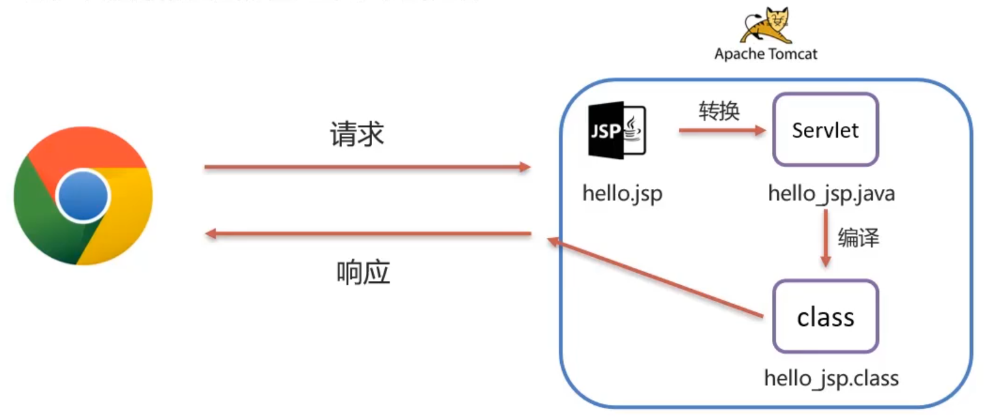

# JSP

## JSP 快速入门

1、导入JSP坐标

```xml
<dependency>
	<groupld>javax.servlet.jsp</groupld>
	<artifactld>jsp-api</artifactld>
	<version>2.2</version>
	<scope>provided</scope>
</dependency>
```

2、创建JSP文件

3、编写 HTIML标签 和 Java代码

```jsp
<body>
	<h1>hello jsp~</h1>
	<% System.out.printf("jsp hello~");%>
</body>
```

## JSP 原理

- JSP = HTML + Java，用于简化开发的
- JSP 本质上就是一个 Servlet
- JSP 在被访问时，由JSP容器(Tomcat)将其转换为 Java文件(Servlet)，在由JSP容器(Tomcat)将其编译，最终对外提供服务的其实就是这个字节码文件




## JSP 脚本

JSP脚本用于在JSP页面内定义 Java代码
JSP 脚本分类:

- `<%...%>` 内容会直接放到 jspService 方法之中
- `<%=...%>` 内容会放到out.print 中，作为out.print 的参数
- `<%!...%>` 内容会放到 jspService 方法之外，被类直接包含

## JSP 缺点

由于JSP页面内，既可以定义 HTML 标签，又可以定义 Java代码，造成了以下问题 :

- 书写麻烦: 特别是复杂的页面
- 阅读麻烦
- 复杂度高: 运行需要依赖于各种环境，JRE，JSP容器，JavaEE
- 占内存和磁盘:JSP会自动生成java和.class文件占磁盘，运行的是.class文件占内存
- 调试困难:出错后，需要找到自动生成的java文件进行调试
- 不利于团队协作:前端人员不会 Java，后端人员不精 HTML


## EL 表达式

- Expression Language 表达式语言，用于简化JSP页面内的Java代码
- 主要功能:获取数据
- 语法 :  `${expression]`
- `$[brands]，获取域中存储的key为brands的数据
- JavaWeb中的四大域对象：
  1. page: 当前页面有效
  2. request: 当前请求有效
  3. session:当前会话有效
  4. application:当前应用有效

> **el表达式获取数据，会依次从这4个域中寻找，直到找到为止** 

## JSTL-if

```jsp
<c:if test="${flag == 1]">
  男
</c:if>
<c:if test="${flag == 2]">
  女
</c:if>
```

1、导入坐标

```xml
<dependency>
  <groupld>jstl</groupld>
  <artifactld>jstl</artifactld>
  <version>1.2</version>
</dependency>
<dependency>
  <groupld>taglibs</groupld>
  <artifactld>standard</artifactld>
  <version>1.1.2</version>
</dependency>
```

2、在JSP页面上引入JSTL标签库

```jsp
<%@ taglib prefix="c" uri="http://java.sun.com/jsp/jstl/core" %>
```

3、使用


## JSTL-forEach


