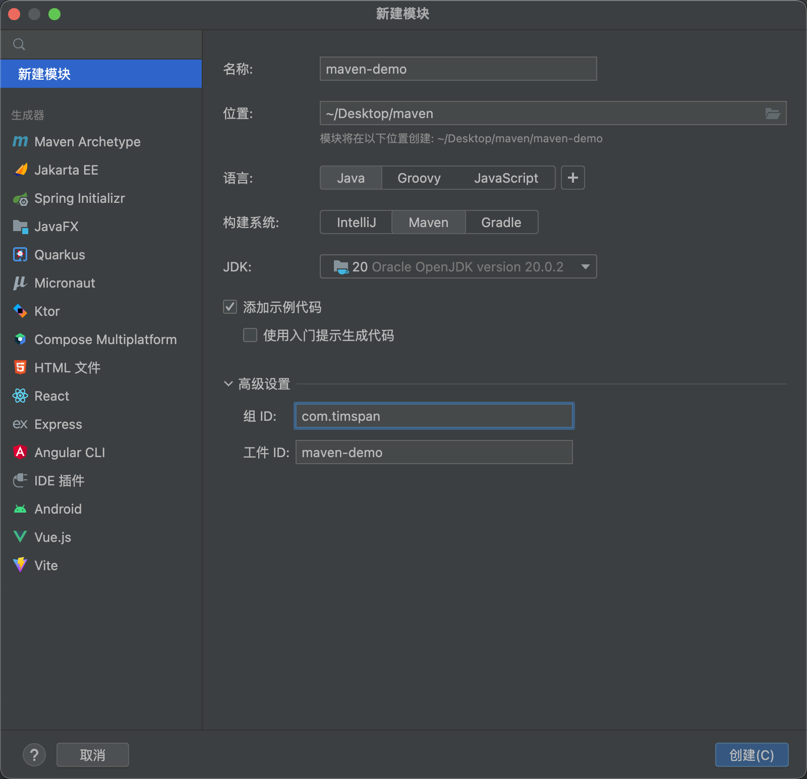
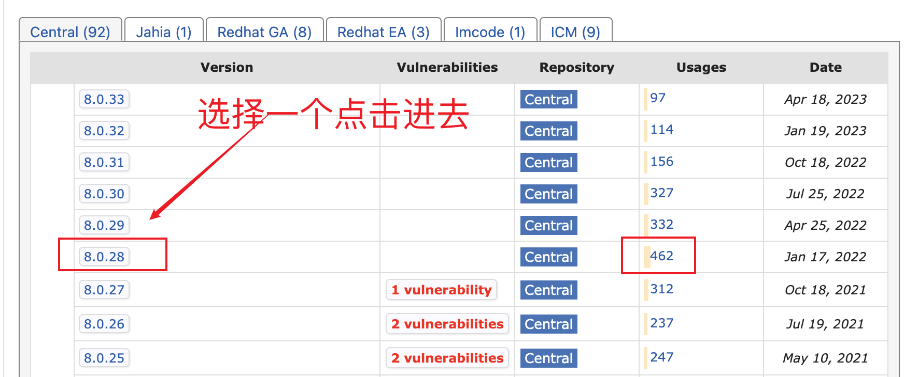
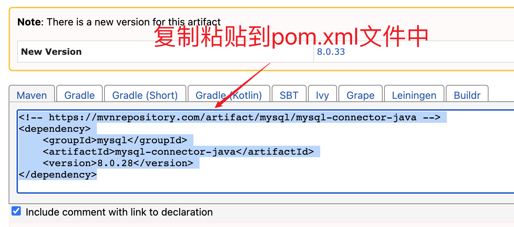

# Maven

## Maven 概述

Maven 是专门用于管理和构建 Java 项目的工具，它的主要功能有:

- 提供了一套标准化的项目结构
- 提供了一套标准化的构建流程 (编译，测试，打包，发布......)
- 提供了一套依赖管理机制

> 不同 IDE(`eclipse`,`myeclipse`,`IDEA`)之间，项目结构不一样，是不通用的

:::tip tip

- Maven 提供了一套标准化的项目结构
- 所有 IDE 使用 Maven 构建的项目结构完全一样
- 所有 IDE 创建的 Maven 项目可以通用

:::

## 安装

macOS 自带 maven，不需要安装

但值得一提的是需要正确定义 JAVA_HOME 环境变量：

1. 运行以下命令来查找 Java 安装目录

   - ```sh
     /usr/libexec/java_home
     ```

2. 运行以下命令来设置 JAVA_HOME 环境变量

   - ```sh
     export JAVA_HOME=/path/to/java/installation
     ```

   - 将"/path/to/java/installation"替换为你复制的 Java 安装目录路径。

   - 然后，再次尝试运行 `Mvn --version 命令，看看问题是否解决了

```sh
brew install maven
```

```sh
mvn -v
```

我的 maven 安装路径：

```sh
/opt/homebrew/Cellar/maven/3.9.4/libexec
```

访达进入此目录

```
/opt/homebrew/Cellar/maven/3.9.4/libexec/conf
```

修改`setting.xml`文件：配置镜像

```xml
<mirrors>
  <mirror>
    <id>aliyun</id>
    <name>Aliyun Maven Mirror</name>
    <url>https://maven.aliyun.com/repository/public</url>
    <mirrorOf>central</mirrorOf>
  </mirror>
</mirrors>
```

```xml
<mirrors>
  <mirror>
    <id>aliyun</id>
    <name>Aliyun Maven Mirror</name>
    <url>http://maven.aliyun.com/nexus/content/groups/public/</url>
    <mirrorOf>central</mirrorOf>
  </mirror>
</mirrors>
```


## Maven 命令：

1. mvn clean：清理项目，删除生成的目录和文件。
2. mvn compile：编译项目源代码。
3. mvn test：运行项目的单元测试。
4. mvn package：将项目打包为可分发的格式，如 JAR、WAR 或 EAR。
5. mvn install：将项目构建结果安装到本地 Maven 仓库，以供其他项目使用。
6. mvn deploy：将项目构建结果部署到远程 Maven 仓库，以供其他开发人员使用。
7. mvn clean install：清理项目并将构建结果安装到本地 Maven 仓库。
8. mvn clean package：清理项目并将项目打包为可分发的格式。
9. mvn clean test：清理项目并运行项目的单元测试。
10. mvn clean compile：清理项目并编译项目源代码。

> 运行 mvn --help 命令来查看所有可用的 Maven 命令和选项。

## IDEA 创建 Maven


### IDEA 配置 Maven 环境

1. 选择 IDEA中 File --> Settings
2. 搜索 maven
3. 设置 IDEA 使用本地安装的 Maven，并修改配置文件路径

```
/opt/homebrew/Cellar/maven/3.9.4/libexec
```

```
/opt/homebrew/Cellar/maven/3.9.4/libexec/conf/settings.xml
```

```
/opt/homebrew/Cellar/maven/3.9.4/libexec/repository
```

### IDEA 创建 Maven 项目

1. 创建模块，选择Maven，点击Next
2. 填写模块名称，坐标信息，点击finish，创建完成
3. 编写 HelloWorld，并运行





> 需要选择 zulu11 SDK


### Maven 坐标详解

什么是坐标?

- Maven 中的坐标是`资源的唯一标识`
- 使用坐标来定义项目或引入项目中需要的依赖

Maven 坐标主要组成

- groupld: 定义当前Maven项目隶属组织名称(通常是域名反写，例如: com.timspan
- artifactld: 定义当前Maven项目名称(通常是模块名称，例如 order-service、goods-service)
- version:定义当前项目版本号

```xml
<?xml version="1.0" encoding="UTF-8"?>
<project xmlns="http://maven.apache.org/POM/4.0.0"
         xmlns:xsi="http://www.w3.org/2001/XMLSchema-instance"
         xsi:schemaLocation="http://maven.apache.org/POM/4.0.0 http://maven.apache.org/xsd/maven-4.0.0.xsd">
    <modelVersion>4.0.0</modelVersion>
    <groupId>com.timspan</groupId>
    <artifactId>maven-demo</artifactId>
    <version>1.0-SNAPSHOT</version>
</project>
```


### 依赖管理

依赖相关地址：https://mvnrepository.com/artifact/mysql/mysql-connector-java






使用坐标导入 jar 包

1. 在 pom.xml 中编写 `<dependencies>` 标签
2. 在 `<dependencies>` 标签中使用 `<dependency>`引入坐标
3. 定义坐标的 groupld，artifactld，version
4. 点击刷新按钮，使坐标生效


如何自动保存？


### 依赖范围

通过设置坐标的依赖范围(scope)，可以设置对应jar包的作用范围: `编译环境`、`测试环境`、`运行环境`

```xml
        <dependency>
            <groupId>org.mybatis</groupId>
            <artifactId>mybatis</artifactId>
            <version>3.5.6</version>
            // highlight-next-line
            <scope>test</scope>
        </dependency>
```


