# MySql

## 安装

❌ 不推荐 dmg 安装

✅ 推荐 brew 安装

**不要问为什么！**

我的安装位置

```
/opt/homebrew/opt/mysql
```

## mysql 数据模型

关系型数据库是建立在关系模型基础上的数据库，简单说，关系型教据库是由多张能互相连接的 二维表 组成的数据库优点：

1. 都是使用表结构，格式一致，易于维护
2. 使用通用的 SQL 语言操作，使用方便，可用于复杂查询.
3. 数据存储在磁盘中，安全.

## mysql 简介

1. 英文: Structured Query Language，简称 SQL
2. 结构化查询语言，一门操作关系型数据库的编程语言
3. 定义操作所有关系型数据库的统一标准
4. 对于同一个需求，每一种数据库操作的方式可能会存在一些不一样的地方，我们称为“方言

5. SQL 语句可以单行或多行书写，以分号结尾
6. MySQL 数据库的 SQL 语句不区分大小写，关键字建议使用大写
7. 注释：
   - 单行注释: -- 注释内容 或 #注释内容(MySQL 特有)
   - 多行注释: /_ 注释 _/

```sql
show databases；
```

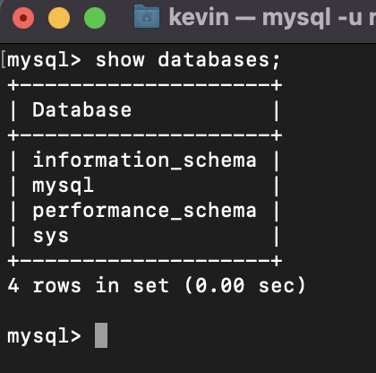

- DDL: 操作数据库，表等
- DML:**对表中的数据进行增删改**
- DQL:**对表中的数据进行查询**
- DCL:对数据库进行权限控制

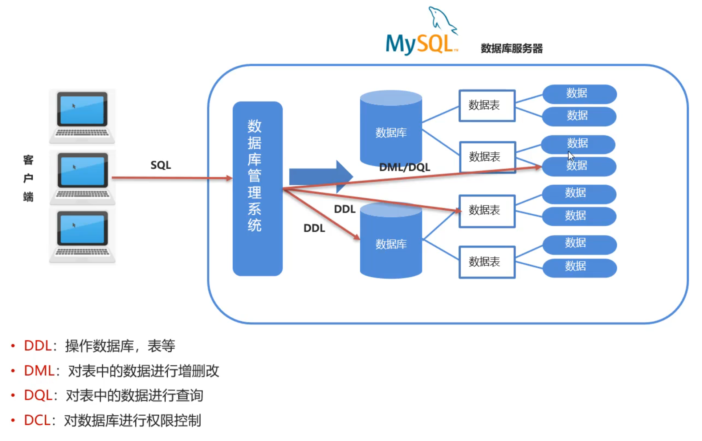

## DDL-操作数据库

1.查询

```sql
SHOW DATABASES:
```

2.创建

- 创建数据库

- ```sql
  CREATE DATABASE 数据库名称;
  ```

- 创建数据库(判断，如果不存在则创建)

- ```sql
    CREATE DATABASE IF NOT EXISTS 数据库名称;
  ```

  3.删除

- 删除数据库

- ```sql
  DROP DATABASE 数据库名称:
  ```

- 删除数据库(判断，如果存在则删除)

- ```sql
    DROP DATABASE IF EXISTS 数据库名称;
  ```

  4.使用数据库

- 查看当前使用的数据库

- ```sql
  SELECT DATABASE();
  ```

- 使用数据库

- ```sql
  USE 数据库名称;
  ```

## DDL-操作表-查询

- 查询当前数据库下所有表名称

- ```sql
  SHOW TABLES;
  ```

- 查询表结构

- ```sql
  DESC 表名称;
  ```

## DDL-操作表-创建表

```sql
CREATE TABLE 表名(
	字段名1 数据类型1,
	字段名2 数据类型2,
	字段名n 数据类型n
);
```

> 注意:最后一行末尾，不能加逗号

## MySQL 数据类型

更详细的说明在：https://www.runoob.com/mysql/mysql-data-types.html

### 数值类型

| 类型           | 大小    | 用途            |
| :------------- | :------ | :-------------- |
| TINYINT        | 1 Bytes | 小整数值        |
| SMALLINT       | 2 Bytes | 大整数值        |
| MEDIUMINT      | 3 Bytes | 大整数值        |
| INT 或 INTEGER | 4 Bytes | 大整数值        |
| BIGINT         | 8 Bytes | 极大整数值      |
| FLOAT          | 4 Bytes | 单精度 浮点数值 |
| DOUBLE         | 8 Bytes | 双精度 浮点数值 |
| DECIMAL        |         | 小数值          |

### 日期和时间类型

| 类型      | 大小 ( bytes) | 用途                     |
| :-------- | :------------ | :----------------------- |
| DATE      | 3             | 日期值                   |
| TIME      | 3             | 时间值或持续时间         |
| YEAR      | 1             | 年份值                   |
| DATETIME  | 8             | 混合日期和时间值         |
| TIMESTAMP | 4             | 混合日期和时间值，时间戳 |

### 字符串类型

| 类型       | 大小                  | 用途                            |
| :--------- | :-------------------- | :------------------------------ |
| CHAR       | 0-255 bytes           | 定长字符串                      |
| VARCHAR    | 0-65535 bytes         | 变长字符串                      |
| TINYBLOB   | 0-255 bytes           | 不超过 255 个字符的二进制字符串 |
| TINYTEXT   | 0-255 bytes           | 短文本字符串                    |
| BLOB       | 0-65 535 bytes        | 二进制形式的长文本数据          |
| TEXT       | 0-65 535 bytes        | 长文本数据                      |
| MEDIUMBLOB | 0-16 777 215 bytes    | 二进制形式的中等长度文本数据    |
| MEDIUMTEXT | 0-16 777 215 bytes    | 中等长度文本数据                |
| LONGBLOB   | 0-4 294 967 295 bytes | 二进制形式的极大文本数据        |
| LONGTEXT   | 0-4 294 967 295 bytes | 极大文本数据                    |

## DDL-操作表-修改删除

### 删除表

- 1、删除表

- ```sql
  DROP TABLE 表名;
  ```

- 2、删除表时判断表是否存在

- ```sql
  DROP TABLE IF EXISTS 表名;
  ```

### 修改表

- 1.修改表名

- ```sql
  ALTER TABLE 表名 RENAME TO 新的表名;
  ```

- 2.添加一列

- ```sql
  ALTER TABLE 表名 ADD 列名 数据类型;
  ```

- 3.修改数据类型

- ```sql
  ALTER TABLE 表名 MODIFY 列名 新数据类型;
  ```

- 4.修改列名和数据类型

- ```sql
  ALTER TABLE 表名 CHANGE 列名 新列名 新数据类型;
  ```

- 5.删除列

- ```sql
  ALTER TABLE 表名 DROP 列名;
  ```

## navicat

```shell
ipconfig getifaddr en0
# 或
osascript -e "IPv4 address of (system info)"

windows:ipconfig

ping IP地址: 检查网络是否连通
```

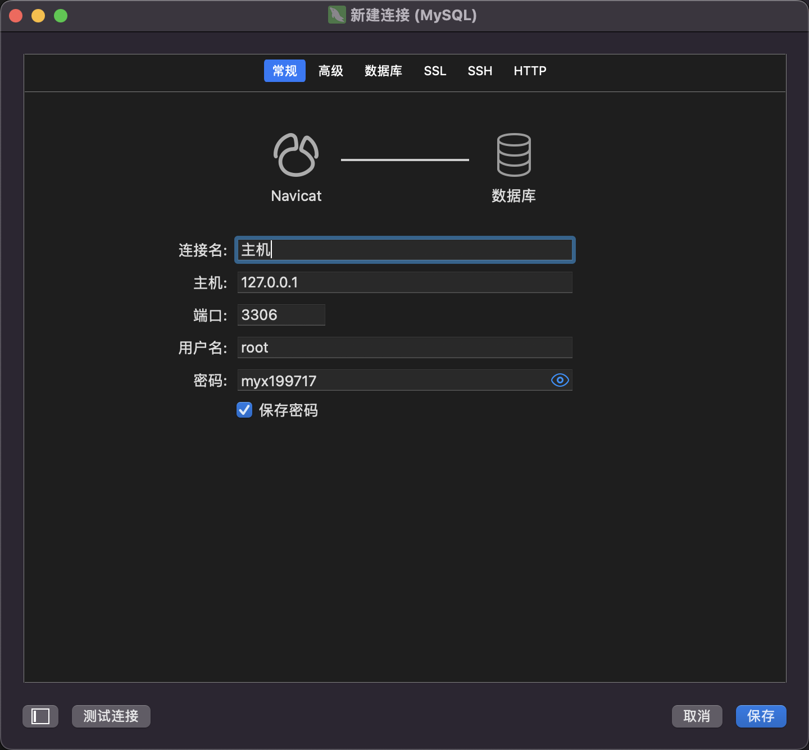

想敲命令？点击查询，新建查询

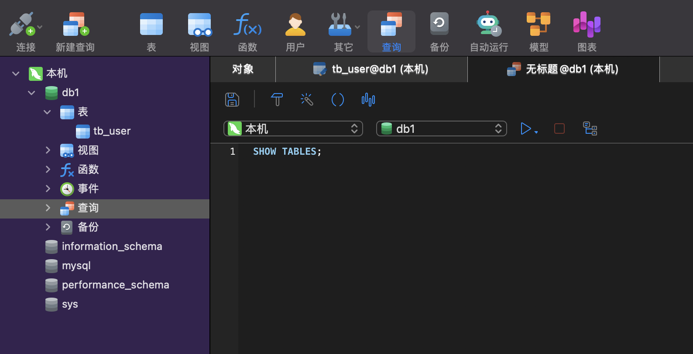

选中代码执行

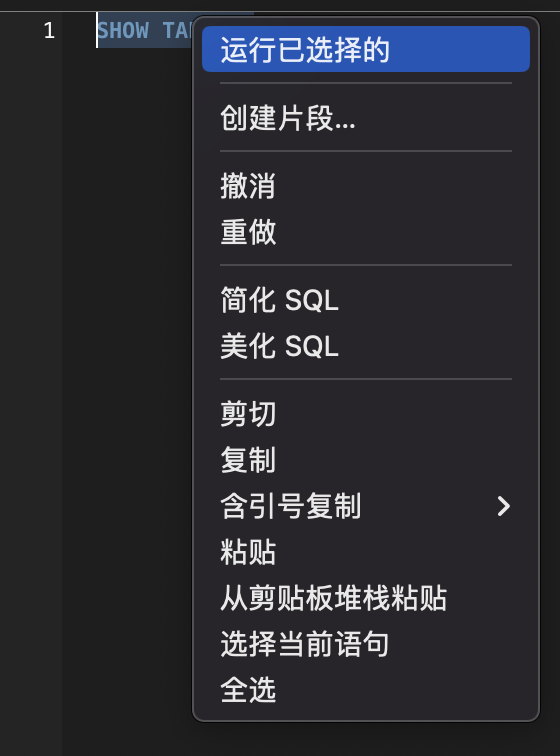

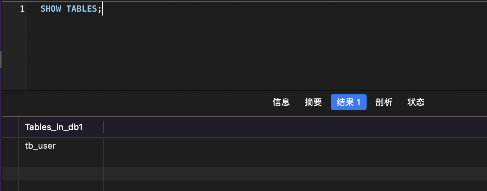

## DML

添加] (insert)修改 (update)删除 (delete)

### 添加数据

1.给指定列添加数据

```sql
INSERT INTO 表名(列名1,列名2....)VALUES(值1,值2...);
```

2.给全部列添加数据

```sql
INSERT INTO 表名 VALUES(值1,值2,...);
```

3.批量添加数据

```sql
INSERT INTO 表名(列名1,列名2.)VALUES(值1,值2,...),(值1,值2,..),(值1,值2....)....INSERT INTO 表名 VALUES(值1,值2....),(值1,值2....),(值1,值2....)...;
```

### 修改数据

1.修改表数据

```sql
UPDATE 表名 SET 列名1=值1,列名2=值2....[WHERE 条件] ;
```

> 注意:修改语句中如果不加条件，则将所有数据都修改!

### 删除数据

1.删除数据

```sql
DELETE FROM 表名 [WHERE 条件];
```

> 注意:删除语句中如果不加条件，则将所有数据都删除

## DQL

查询语法

```sql
SELECT
字段列表
FROM
表名列表
WHERE
条件列表
GROUP BY
分组字段
HAVING
分组后条件
ORDER BY
排序字段
LIMIT
分页限定
```

## DQL-基础查询

1.查询多个字段

```sql
SELECT 字段列表 FROM 表名;
SELECT* FROM 表名;-- 查询所有数据
```

2.去除重复记录

```sql
SELECT DISTINCT 字段列表 FROM 表名:
```

3.起别名

```sql
AS:AS 也可以省略
```

## DQL-条件查询

1.条件查询语法

```sql
SELECT 字段列表 FROM 表名 WHERE 条件列表;
```

条件列表

| 运算符      | 说明             |
| ----------- | ---------------- |
| `=`         | 等于             |
| `<>`        | 不等于           |
| `>`         | 大于             |
| `<`         | 小于             |
| `>=`        | 大于等于         |
| `<=`        | 小于等于         |
| BETWEEN     | 在某个范围内     |
| LIKE        | 模糊匹配         |
| IN          | 在给定的值列表中 |
| IS NULL     | 为空             |
| IS NOT NULL | 不为空           |
| AND         | 逻辑与           |
| OR          | 逻辑或           |
| NOT         | 逻辑非           |

## DQL-模糊查询

示例：

1、查询姓'马"的学员信息

```sql
select * from stu where name like '马%';
```

2、查询第二个字是'花"的学员信息

```sql
select * from stu where name like '_花%';
```

3、查询名字中包含，德’的学员信息

```sql
select * from stu where name like '%徳%';
```

## DQL-排序查询

1.排序查询语法

```sql
SELECT 字段列表 FROM 表名 ORDER BY 排序字段名1 [排序方式1],排序字段名2 [排序方式2] ...;
```

排序方式

- ASC: 升序排列 (默认值)
- DESC:降序排列

> 注意：如果有多个排序条件，当前边的条件值一样时，才会根据第二条件进行排序

1. 查询学生信息，按照年龄升序排列

   - ```sql
     select * from stu order by age ;
     ```

2. 查询学生信息，按照数学成绩降序排排列

   - ```sql
     select *from stu order by math desc;
     ```

3. 查询学生信息，按照数学成绩降序排列，如果数学成绩一样，再按照英语成绩升序排列

   - ```sql
     select * from stu order by math desc english asc
     ```

## DQL-聚合查询

聚合函数

1. 概念

   - 将一列数据作为一个整体，进行纵向计算。

2. 聚合函数分类:

   - | 聚合函数             | 描述                         |
     | -------------------- | ---------------------------- |
     | `COUNT(列名)`        | 返回指定列的**行数**         |
     | `SUM(列名)`          | 返回指定列的**总和**         |
     | `AVG(列名)`          | 返回指定列的**平均值**       |
     | `MAX(列名)`          | 返回指定列的**最大值**       |
     | `MIN(列名)`          | 返回指定列的**最小值**       |
     | `GROUP_CONCAT(列名)` | 将指定列的值连接为一个字符串 |
     | `STDDEV(列名)`       | 返回指定列的**标准差**       |
     | `VARIANCE(列名)`     | 返回指定列的**方差**         |

3. 聚合函数语法

   - ```sql
     SELECT 聚合函数名(列名) FROM 表;
     ```

   - > 注意: null 值不参与所有聚合函数运算

## DQL-分组查询

分组查询语法:

```sql
SELECT 字段列表 FROM 表名 [WHERE 分组前条件限定] GROUP BY 分组字段名 [HAVING 分组后条件过滤];
```

> 注意：分组之后，查询的字段为聚合函数和分组字段，查询其他字段无任何意义

where 和 having 区别:

- 执行时机不一样: where 是分组之前进行限定，不满足 where 条件，则不参与分组，而 having 是分组之后对结果进行过滤。
- 可判断的条件不一样: where 不能对聚合函数进行判断，having 可以。

> 执行顺序: `where >聚合函数 >having`

1. 查询男同学和女同学各自的数学平均分

   - ```sql
     select sex, avg(math) from stu group by sex;
     ```

2. 查询男同学和女同学各自的数学平均分，以及各自人数

   - ```sql
     select sex, avg(math),count(*) from stu group by sex;
     ```

3. 查询男同学和女同学各自的数学平均分，以及各自人数，要求:分数低于 70 分的不参与分组

   - ```sql
     select sex, avg(math),count(*) from stu whre math > 70 group by sex;
     ```

4. 查询男同学和女同学各自的数学平均分，以及各自人数，要求:分数低于 70 分的不参与分组，分组之后人数大于 2 个的

   - ```sql
     select avg (math) ,count(x) from stu where math > 70 group by sex having count(*) > 2
     ```

## DQL-分页查询

分页查询语法

```sql
SELECT 字段列表 FROM 表名 LIMIT
```

```
起始索引:从0开始
```

```
计算公式: 起始索引=(当前页码-1) * 每页显示的条数
```

:::tip tips

- 分页查询 limit 是 MySQl 数据库的方言
- Oracle 分页查询使用 rownumber
- SQL Server 分页查询使用 top

:::

1. 从 0 开始查询，查询 3 条数据

   - ```sql
     select *from stu limit 0 ，3;
     ```

2. 每页显示 3 条数据，查询第 1 页数据

   - ```sql
     select *from stu limit 0 ， 3;
     ```

3. 每页显示 3 条数据，查询第 2 页数据

   - ```sql
     select *from stu limit 3，3;
     ```

4. 每页显示 3 条数据，查询第 3 页数据

   - ```sql
     select * from stu limit 6 ， 3;
     ```

## 约束和分类

约束的概念

- 约束是作用于表中列上的规则，用于限制加入表的数据
- 约束的存在保证了数据库中数据的正确性、有效性和完整性

约束的分类

| 约束类型     | 关键字          | 描述                                                               |
| ------------ | --------------- | ------------------------------------------------------------------ |
| 主键约束     | PRIMARY KEY     | 用于唯一标识表中的每一行数据，确保每一行都有唯一的标识符。         |
| 唯一约束     | UNIQUE          | 确保列中的每个值都是唯一的，但允许空值。                           |
| 非空约束     | NOT NULL        | 确保列中的值不为空。                                               |
| **外键约束** | **FOREIGN KEY** | **用于建立表之间的关系，确保一个表中的数据引用另一个表中的数据。** |
| 默认约束     | DEFAULT         | 为列指定默认值，如果插入数据时未提供值，则使用默认值。             |
| 检查约束     | CHECK           | 用于定义列中的值必须满足的条件。                                   |
| 自动递增约束 | AUTO_INCREMENT  | 用于自动生成唯一的整数值，通常用于主键列。                         |

> mysql 8.0.16 之前不支持检查约束

### 约束案例

```sql
DROP TABLE IF EXISTS emp;
-- 员工表
CREATE TABLE emp(
	id INT PRIMARY KEY,-- 员工id，主键且白增长
	ename VARCHAR(50) NOT NULL UNIQUE,-- 员工姓名，非空并且唯一
	joindate DATE NOT NULL,-- 入职日期，非空
  salary DOUBLE(7,2) NOT NULL,
	bonus DOUBLE(7,2) DEFAULT 0 -- 奖金，如果没有奖金默认为0
);

INSERT INTO emp (id,ename,joindate,salary,bonus) values (1,'张三','1999-11-11',8800,5000);
SELECT * from emp;
```

### 外键约束

示例代码：

```sql
-- 部门表
DROP TABLE
IF
	EXISTS dept;
CREATE TABLE dept (
	id INT PRIMARY KEY AUTO_INCREMENT,
	dep_name VARCHAR ( 20 ),
	addr VARCHAR ( 20 )
);-- 员工表
DROP TABLE
IF
	EXISTS emp;
CREATE TABLE emp (
	id INT PRIMARY KEY AUTO_INCREMENT,
	NAME VARCHAR ( 20 ),
	age INT,
	dep_id INT
);-- 添加部门数据
INSERT INTO dept ( dep_name, addr )
VALUES
	( '研发部', '广州' ),
	( '销售部', '深圳' );-- 添加员工数据，dep_id 表示员工所在的部门
INSERT INTO emp ( NAME, age, dep_id )
VALUES
	( '张三', 20, 1 ),
	( '李四', 20, 1 ),
	( '王武', 20, 1 ),
	( '赵六', 20, 1 ),
	( 'kevin', 20, 1 ),
	( '毛玉翔', 20, 1 );
SELECT
	*
FROM
	emp;
```

如何此时把研发部删了，但是我研发部的员工还在，就造成了数据的不完整

:::tip 建立链接

使用外键来让两个表的数据之间建立链接，保证数据的一致性和完整性

语法

1. 添加约束

   - ```sql
     -- 创建表时添加外键约束
     CREATE TABLE 表名(
     	列名 数据类型,
     	...
     	[CONSTRAINT] [外键名称] FOREIGN KEY(外键列名) REFERENCES 主表(主表列名)
     );
     ```

   - ```sql
     -- 建完表后添加外键约束
     ALTER TABLE 表名 ADD CONSTRAINT 外键名称 FOREIGN KEY(外键字段名称)REFERENCES 主表名称(主表列名称);
     ```

2. 删除约束

   - ```sql
     ALTER TABLE 表名 DROP FOREIGN KEY 外键名称:
     ```

:::

创建表时添加外键约束

```sql
-- 部门表
DROP TABLE
IF
	EXISTS dept;
CREATE TABLE dept (
	id INT PRIMARY KEY AUTO_INCREMENT,
	dep_name VARCHAR ( 20 ),
	addr VARCHAR ( 20 )
);-- 员工表
DROP TABLE
IF
	EXISTS emp;
CREATE TABLE emp (
	id INT PRIMARY KEY AUTO_INCREMENT,
	NAME VARCHAR ( 20 ),
	age INT,
	dep_id INT,
	-- 添加外键 dep_id ,关联 dept 表的id 主键
	-- 格式：
	-- [CONSTRAINT] [外键名称] FOREIGN KEY(外键列名) REFERENCES 主表(主表列名)
	CONSISTENT fk_emp_dept FOREIGN KEY(dep_id) REFERENCES dept(id)
);-- 添加部门数据
INSERT INTO dept ( dep_name, addr )
VALUES
	( '研发部', '广州' ),
	( '销售部', '深圳' );-- 添加员工数据，dep_id 表示员工所在的部门
INSERT INTO emp ( NAME, age, dep_id )
VALUES
	( '张三', 20, 1 ),
	( '李四', 20, 1 ),
	( '王武', 20, 1 ),
	( '赵六', 20, 1 ),
	( 'kevin', 20, 1 ),
	( '毛玉翔', 20, 1 );
SELECT
	*
FROM
	emp;
SELECT
	*
FROM
	dept;
```

:::tip 重点

在没有创建外键之前，表是独立的。那么创建了外键之后，先去创建被关联的表，也就是先创建`dept`部门表再去创建`emp`员工表。同理，添加数据也是一样的：先有部门，再有员工

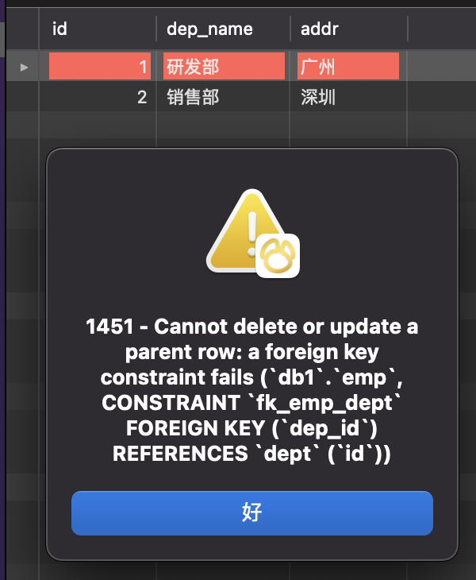

这个时候必须先删除员工数据才能删除部门数据，否则就会报错

:::

选中相关联的表，可以看表之间的关系

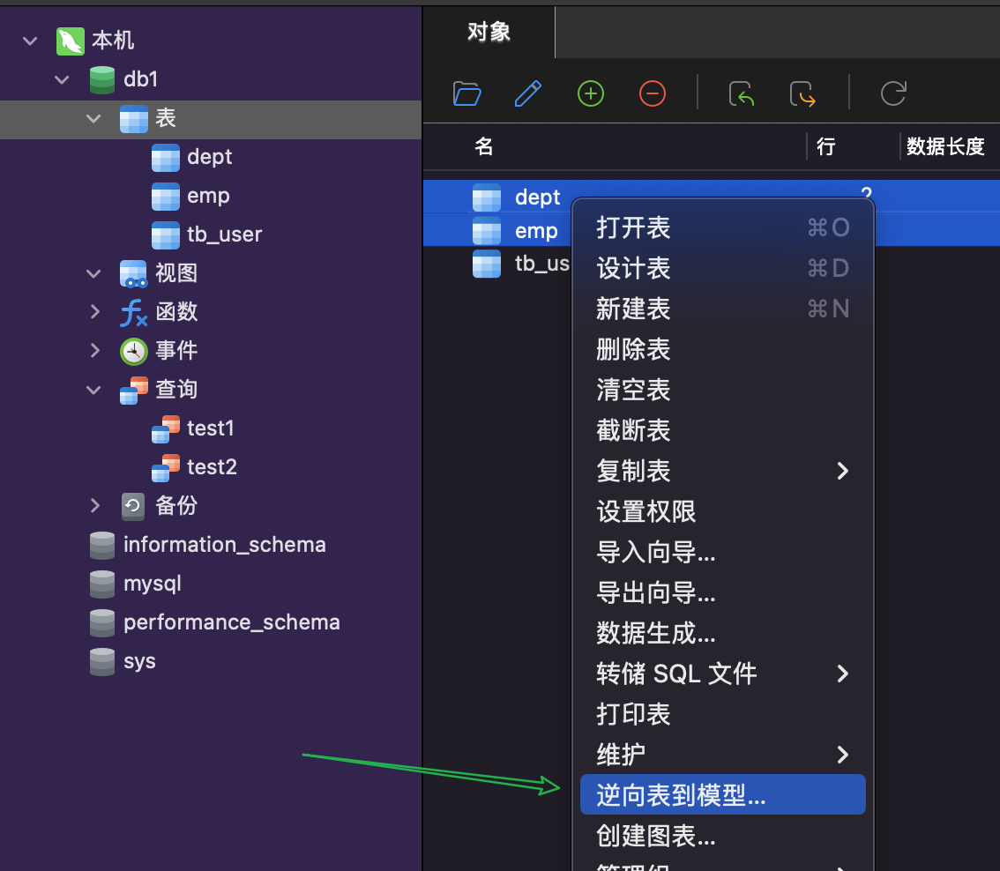

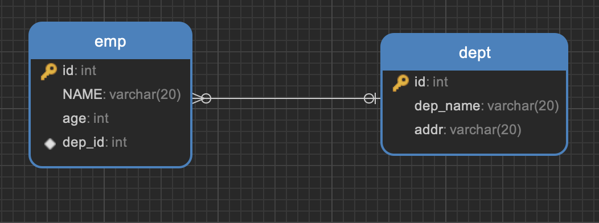

## 数据库设计

1、表关系之一对多

一对多(多对一):

- 如:部门表 和 员工表
- 一个部门对应多个员工，一个员工对应一个部门

> 实现方式:在多的一方建立外键，指向一的一方的主键

2、表关系之多对多
多对多:

- 如: 订单和 商品
- 一个商品对应多个订单，一个订单包含多个商品

> 实现方式:建立第三张**中间表**，中间表至少包含**两个外键**，分别**关联两方主键**

3、表关系之一对一
一对一:

- 如:用户 和 用户详情
- 一对一关系多用于表拆分，将一个实体中经常用的字段放一张表，不经常使用的字段放另一张表，用于提升查询性能

> 实现方式:在任意一方加入外键，关联另一方主键，并且设置外键为唯一(UNIQUE)

## 多表查询

```sql
-- 笛卡尔积：有A,B两个集合，取A，B所有的组合情况
-- 多表查询 消除无效数据
SELECT*FROM dept,emp WHERE emp.dep_id - dept.id;
```

多表查询:从多张表查询数据

1. 连接查询
   - 内连接：相当于查询 A B 交集数据
   - 外连接：
     - 左外连接:相当于查询 A 表所有数据和交集部分数据
     - 右外连接:相当于查询 B 表所有数据和交集部分数据
2. 子查询

### 多表查询-内连接

内连接查询语法

- 隐式内连接

- ```sql
  SELECT 字段列表 FROM表1,表2... WHERE 条件;
  ```

- 显示内连接

- ```sql
  SELECT 字段列表 FROM 表1 [INNER] JOIN 表2 ON 条件;
  ```

> **内连接相当于查询 A B 交集数据**

隐式内连接示例：

```sql
SELECT
	emp.NAME,
	emp.age,
	dept.dep_name
FROM
	emp,
	dept
WHERE
	emp.dep_id = dept.id;
```

给表起别名

```sql
SELECT
	t1.NAME,
	t1.age,
	t2.dep_name
FROM
	emp t1,
	dept t2
WHERE
	t1.dep_id = t2.id;
```

显示内连接示例：

```sql
SELECT
	*
FROM
	emp
	INNER JOIN dept ON emp.dep_id = dept.id;-- INNER可以省略
SELECT
	*
FROM
	emp
	JOIN dept ON emp.dep_id = dept.id;
```

### 多表查询-外连接

- 左外连接：相当于查询 A 表所有数据和交集部分数据

- ```sql
  SELECT 字段列表 FROM 表1 LEFT [OUTER] JOIN 表2 0N 条件;
  ```

- 右外连接：相当于查询 B 表所有数据和交集部分数据

- ```sql
  SELECT 字段列表 FROM 表1 RIGHT [OUTER] JOIN 表2 0N 条件;
  ```

```sql
-- 左外连接
SELECT
	*
FROM
	emp
	LEFT JOIN dept ON emp.dep_id = dept.id;
-- 右外连接
SELECT
	*
FROM
	emp
	RIGHT JOIN dept ON emp.dep_id = dept.id;
```

### 多表查询-子查询

查询中嵌套查询，称嵌套查询为子查询

子查询根据查询结果不同，作用不同：

- 单行单列
- 多行单列
- 多行多列

```sql
select * from emp where salary > (select salary from emp where name='猪八戒');
```

子查询根据查询结果不同，作用不同

- 单行单列: 作为条件值，使用 `= != > <` 等进行条判断

- ```sql
  SELECT 字段列表 FROM 表 WHERE 字段名 = (子查询);
  ```

- 多行单列:作为条件值，使用 in 等关键字进行条件判断

- ```sql
  SELECT 字段列表 FROM 表 WHERE 字段名 in(子查询);
  ```

- 多行多列:作为虚拟表

- ```sql
  SELECT 字段列表 FROM (子查询) WHERE 条件;
  ```

## 事务

- 数据库的事务(Transaction)是一种机制、一个操作序列，包含了**一组数据库操作命令**
- 事务把所有的命令作为一个整体一起向系统提交或撤销操作请求，即这一组数据库命令**要么同时成功，要么同时失败**
- 事务是一个不可分割的工作逻辑单元

```sql
-- 开启事务
START TRANSACTION;
或者 BEGIN;
-- 提交事务
COMMIT;
回滚事务
ROLLBACK;
```

场景：A 向 B 借 500 块钱 ，如果如果借钱流程中间出了问题，本来两个人都有 1000 块钱，然后钱借出去后出了问题，两个人总数变成了 1500（就不合理了，明明是 2000 的）

示例：A 向 B 借钱 ，如果借钱流程中间出了问题就回滚事务

```sql
DROP TABLE IF EXISTS account;
--创建账户表
CREATE TABLE account(
	id int PRIMARY KEY auto increment,
	name varchar(10),
  money double(10, 2)
  );
--添加数据
INSERT INTO account (name,money) values('张三',1000),('李四',1000);
select * from account;
```

```sql
-- 转账操作
-- 开启事务
BEGIN;
-- 1.查询李四的余额
-- 2.李四金额 -500
UPDATE account set money = money - 500 where name = '李四';
-- 出错了...
-- 3.张三金额 + 500
UPDATE account set money = money + 500 where name = '张三';
-- 提交事务
commit;
-- 回滚事务
ROLLBACK;
```

### 事务四大特征

- 原子性 (Atomicity): 事务是不可分割的最小操作单位，要么同时成功，要么同时失败
- 一致性 (Consistency) :事务完成时，必须使所有的数据都保持一致状态
- 隔离性 (Isolation) :多个事务之间，操作的可见性
- 持久性(Durability) :事务一旦提交或回滚，它对数据库中的数据的改变就是永久的

## JDBC

JDBC 就是使用 Java 语言操作**关系型数据库**的一套 API

### JBDC jar package

下载地址：

https://dev.mysql.com/downloads/connector/j/

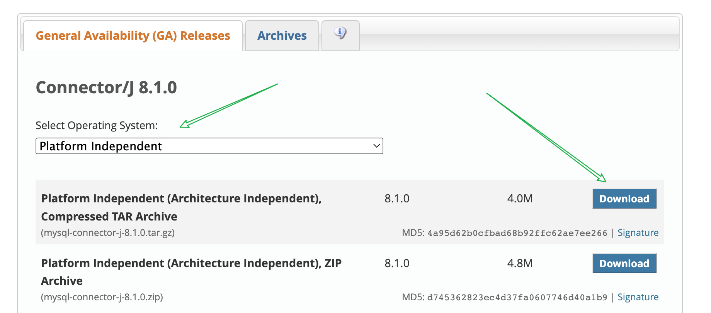

复制 jar 包到 lib 目录下，添加为库

```js
package JBDC_demo;
import java.sql.Connection;
import java.sql.DriverManager;
import java.sql.Statement;
public class JBDC_demo {
    public static void main(String[] args) throws Exception {
        //1.注册驱动
//        Class.forName("com.mysql.cj.jdbc.Driver");
        //2.获取连接对象
        String url = "jdbc:mysql://127.0.0.1:3306/db1?useSSL=false";
        String username = "root";
        String password = "myx199717";
        Connection conn = DriverManager.getConnection(url, username, password);
        //3.定义SQL
        String sql = "update account set money = 3000 where id = 1";
        //4. 获取执行sqL的对象
        Statement stmt = conn.createStatement();//5.执行sqL
        int count = stmt.executeUpdate(sql);//6.处理结果
        //System.out.println(count);
        //7. 释放资源
        stmt.close();
        conn.close();
    }
}

```

:::tip 注意

请注意，根据您使用的 MySQL 版本和 JDBC 驱动程序的版本，驱动程序的类名可能会有所不同。在上述示例中，我使用的是`com.mysql.cj.jdbc.Driver`，这是适用于`MySQL Connector/J 8.x`版本的类名。如果您使用的是不同的 MySQL 版本或 JDBC 驱动程序版本，请根据相应的文档来确定正确的类名。

```
Loading class `com.mysql.jdbc.Driver'. This is deprecated. The new driver class is `com.mysql.cj.jdbc.Driver'. The driver is automatically registered via the SPI and manual loading of the driver class is generally unnecessary.
```

这个警告信息表示`com.mysql.jdbc.Driver`类已经被弃用，新的驱动程序类是`com.mysql.cj.jdbc.Driver`。根据警告信息，驱动程序会通过`SPI（Service Provider Interface）`自动注册，不需要手动加载驱动程序类。

要解决这个警告，您可以尝试删除`Class.forName("com.mysql.jdbc.Driver")`这行代码，因为新的驱动程序会自动注册。只需使用以下代码获取数据库连接即可

请注意，如果您使用的是较旧的 MySQL 版本或特定的 JDBC 驱动程序版本，可能需要手动加载驱动程序类。在这种情况下，请确保使用正确的驱动程序类名，并根据驱动程序的文档进行相应的操作。

:::

### JDBC 简介:

**同一套 Java 代码，操作不同的关系型数据库**

JDBC 概念:

- JDBC 就是使用 Java 语言操作**关系型数据库**的一套 API

JDBC 本质:

- 官方 (sun 公司)定义的一套操作所有关系型数据库的规则，即接口
- 各个数据库厂商去实现这套接口，提供数据库驱动 jar 包
- 我们可以使用这套接口 (JDBC) 编程，真正执行的代码是驱动 jar 包中的实现类

JDBC 好处:

- 各数据库厂商使用相同的接口，Java 代码不需要针对不同数据库分别开发
- 可随时替换底层数据库，访问数据库的 Java 代码基本不变

:::tip **同一套 Java 代码，操作不同的关系型数据库**

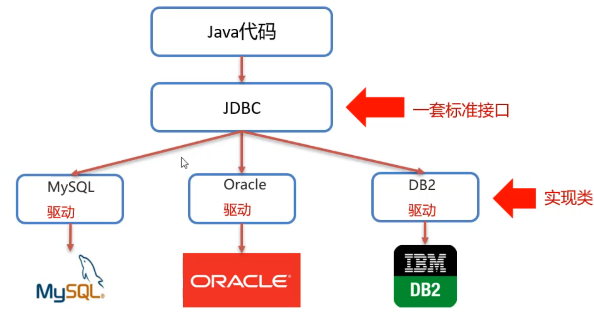

:::

### JDBC API DriverManager

1. url: 连接路径

   - ```js
     语法: jdbc:mysql://ip地址(域名):端口号/数据库名称?参数键值对1&参数键值对2...
     示例: jdbc:mysql://127.0.0.1:3306/db1
     细节:如果连接的是本机mysdl服务器，并且mysdl服务默认端口是3306，则url可以简写为:idbc:mysql://教据库名称?参数键值对配置 useSSL=false 参数，禁用安全连接方式，解决警告提示
     ```

2. user: 用户名

3. password:密码

### JDBC API Connection

**获取执行 SQL 的对象**

1. 普通执行 SQL 对象

   - ```sql
     Statement createStatement()
     ```

2. 预编译 SQL 的执行 SQL 对象:防止 SQL 注入

   - ```sql
     PreparedStatement prepareStatement (sql)
     ```

3. 执行存储过程的对象

   - ```sql
     CallableStatement prepareCall (sql)
     ```

**JDBC 事务管理:**

Connection 接口中定义了 3 个对应的方法

```sql
开启事务: setAutoCommit(boolean autoCommit): true为自动提交事务; false为手动提交事务， 即为开启事务
提交事务: commit()
回滚事务: rollback()
```

```js
package JBDC_demo;

import java.sql.Connection;
import java.sql.DriverManager;
import java.sql.SQLException;
import java.sql.Statement;

public class JBDC_demo {
    public static void main(String[] args) throws Exception {
        String url = "jdbc:mysql://127.0.0.1:3306/db1?useSSL=false";
        String username = "root";
        String password = "myx199717";
        Connection conn = DriverManager.getConnection(url, username, password);
        //3.定义SQL
        String sql1 = "update account set money = 3000 where id = 1";
        String sql2 = "update account set money = 3000 where id = 2";
        //4. 获取执行sqL的对象
        Statement stmt = conn.createStatement();

        try {
            //        开启事务
            conn.setAutoCommit(false);
            //5.执行sqL
            int count1 = stmt.executeUpdate(sql1);
            System.out.println(count1);
            int i = 3 / 0;
            int count2 = stmt.executeUpdate(sql2);
            System.out.println(count2);
            //        提交事务
            conn.commit();
        } catch (Exception e) {
//            回滚事务
            conn.rollback();
            throw new RuntimeException(e);
        }

        //7. 释放资源
        stmt.close();
        conn.close();
    }
}

```

### JDBC API Statement

**执行 sql 语句**

### JDBC API ResultSet

**ResultSet(结果集对象)作用:封装了 DQL 查询语句的结果**

```js
ResultSet stmt.executeQuery(sql): 执行DQL语句，返回 ResultSet 对象
```

获取查询结果:

boolean next0): (1)将光标从当前位置向前移动一行 (2) 判断当前行是否为有效行

返回值:

- true: 有效行，当前行有数据
- false: 无效行，当前行没有数据

xxx getXxx(参数): 获取数据

xxx: 数据类型;如:int getInt(参数);String getString(参数)

参数:

- int: 列的编号，从 1 开始
- String: 列的名称

使用步骤:

1. 游标向下移动一行，并判断该行否有数据: next( )
2. 获取数据: getXxx(参数)

```js
//循环判断游标是否是最后一行末尾
while (rs.next()) {
  //获取数据
  rs.getXxx(参数)
}
```

示例

```js
package JBDC_demo;
import java.sql.*;
public class JBDC_demo_2 {
    public static void main(String[] args) throws Exception {
        String url = "jdbc:mysql://127.0.0.1:3306/db1?useSSL=false";
        String username = "root";
        String password = "myx199717";
        Connection conn = DriverManager.getConnection(url, username, password);
        String sql = "select * from account";
        Statement stmt = conn.createStatement();
//        执行sql
        ResultSet res = stmt.executeQuery(sql);
        while (res.next()) {
//            获取数据
            int id = res.getInt(1);
            String name = res.getString(2);
            double money = res.getDouble(3);
            System.out.println(id);
            System.out.println(name);
            System.out.println(money);
            System.out.println("-----------------");
        }
        res.close();
        stmt.close();
        conn.close();
    }
}
```

输出：

### JDBC API PreparedStatement

PreparedStatement 的作用：预编译 SQL 语句并执行: 预防 SQL 注入问题

SQL 注入：SQL 注入是通过操作输入来修改事先定义好的 SQL 语句，用以达到执行代码对服务器进行攻击的方法

### 防止 SQL 注入

## 数据库连接池

- 数据库连接池是个容器，负责分配、管理数据库连接(Connection)

- 它允许应用程序重复使用一个现有的数据库连接，而不是再重新建立一个

- 释放空闲时间超过最大空闲时间的数据库连接来避免因为没有释放数据库连接而引起的数据库连接遗漏

- 好处:

  - 资源重用
  - 提升系统响应速度
  - 避免数据库连接遗漏

### 数据库连接池实现

- 标准接口:DataSource

  - 官方(SUN)提供的数据库连接池标准接口，由第三方组织实现此接口

  - 功能:获取连接

  - ```
    Connection getConnection()
    ```

- 常见的数据库连接池

  - DBCP
  - C3P0
  - Druid

- Druid(德鲁伊)

  - Druid 连接池是阿里巴巴开源的数据库连接池项目
  - 功能强大，性能优秀，是 Java 语言最好的数据库连接池之一

### Driud 使用

如何快速上手：看文档（http://www.apache-druid.cn/GettingStarted/chapter-1.html）或者问 gpt 吧

1. 导入 jar 包 （druid-1.2.16.jar）
2. 定义配置文件
3. 加载配置文件
4. 获取数据库连接池对象
5. 获取连接

下载：

所有版本地址：https://repo1.maven.org/maven2/com/alibaba/druid/

下载地址：https://repo1.maven.org/maven2/com/alibaba/druid/1.2.16/

releases：https://github.com/alibaba/druid/releases
