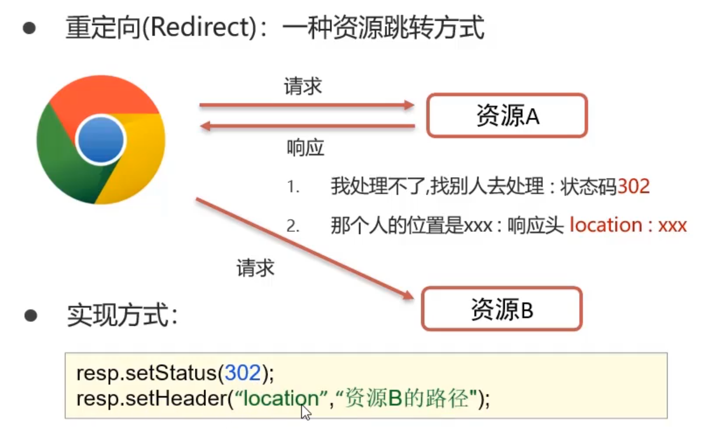

# Request和Response对象

## Request 继承体系

```js
ServletRequest         -------------->    Java提供的请求对象根接口    
HttpServletRequest     -------------->    Java提供的对Http协议封装的请求对象接
RequestFacade          -------------->    Tomcat 定义的实现类
```

## Request 获取请求行数据

`GET /request-demo/req1?username=zhangsan HTTP/1.1`

- String `getMethod` ():获取请求方式: GET
- String `getContextPath` (): 获取虚拟目录(项目访问路径): /request-demo
- StringBuffer `getRequestURL` (): 获取URL(统一资源定位符): http://localhost:8080/request-demo/req1
- String `getRequestURI` ():获取URI(统一资源标识符): /request-demo/req1
- String `getQueryString` (): 获取请求参数(GE方式): username=zhangsan&password=123

```js
package com.TimSpan;

import javax.servlet.ServletException;
import javax.servlet.annotation.WebServlet;
import javax.servlet.http.HttpServlet;
import javax.servlet.http.HttpServletRequest;
import javax.servlet.http.HttpServletResponse;
import java.io.IOException;

@WebServlet("/req1")
public class requestDemo extends HttpServlet {
    @Override
    protected void doGet(HttpServletRequest req, HttpServletResponse resp) throws ServletException, IOException {
        //获取请求方式
        String method = req.getMethod();
        System.out.println(method);
        //获取虚拟目录
        String contextPath = req.getContextPath();
        System.out.println(contextPath);

        //获取 URL
        StringBuffer requestURL = req.getRequestURL();
        System.out.println(requestURL);
        //获取 URI
        String requestURI = req.getRequestURI();
        System.out.println(requestURI);
        //获取请求参数
        String queryString = req.getQueryString();
        System.out.println(queryString);
    }

    @Override
    protected void doPost(HttpServletRequest req, HttpServletResponse resp) throws ServletException, IOException {
//        super.doPost(req, resp);
    }
}

```

访问------>http://localhost:8080/tomcat-demo/req1?username=zhangsan&password=123

控制台输出：

```
GET
/tomcat-demo
http://localhost:8080/tomcat-demo/req1
/tomcat-demo/req1
username=zhangsan&password=123
```

### 请求头/请求体

请求头:User-Agent: Mozilla/5.0 Chrome/91.0.4472.106
String `getHeader`(String name): 根据请求头名称，获取值

请求体username=superbaby&password=123
`ServletInputStream getInputStream()`: 获取字节输入流

`BufferedReader getReader()`: 获取字符输入流

```html
<form action="/tomcat-demo/req1" method="post">
    <input type="text" name="username">
    <input type="password" name="password">
    <input type="submit">
</form>
```


```js
    @Override
    protected void doPost(HttpServletRequest req, HttpServletResponse resp) throws ServletException, IOException {
//        super.doPost(req, resp);
        BufferedReader reader = req.getReader();
        String line = reader.readLine();
        System.out.println(line); //输出 username=ceshi&password=123456

    }
```


## Request通用方式获取请求参数


## 解决中文乱码问题POST

POST:

```js
req.setCharacterEncoding("UTF_8");
```


## 解决中文乱码问题GET

## 请求转发

请求转发(forward): 一种在服务器内部的资源跳转方式


```js
req.getRequestDispatcher("资源B路径").forward(req,resp);
```

请求转发特点:

- 浏览器地址栏路径不发生变化
- 只能转发到当前服务器的内部资源
- 一次请求，可以在转发的资源间使用request共享数据


## Response设置响应数据

响应数据分为3部分
1. 响应行:
  HTTP/1.1 200 OK

  ```js
  void setStatus(int sc):设置响应状态码
  ```

  

2. 响应头:Content-Type: text/html

  ```js
  void setHeader(String name, String value): 设置响应头键值对
  ```

  

3. 响应体

  ```
  <html><head>head><body></body></html>
  ```

  ```js
  PrintWriter getWriter(): 获取字符输出流
  ```

  ```js
  ServletOutputStream getOutputStream():获取字节输出流
  ```

## Response重定向




重定向特点:

- 浏览器地址栏路径发生变化
- 可以重定向到任意位置的资源 (服务器内部、外部均可)
- 两次请求，不能在多个资源使用request共享数据

### 路径

明确路径谁使用?

- 浏览器使用: 需要加虚拟目录(项目访问路径)
- 服务端使用: 不需要加虚拟目录


## Response响应字符数据

使用:

1 、通过Response对象获取字符输出流

```js
PrintWriter writer = resp.getWriter( );
```

2、写数据

```js
writer.write("aaa");
```


:::tip 注意

- 该流不需要关闭，随着响应结束，response对象销毁，由服务器关闭

- 中文数据乱码: 原因通过Response获取的字符输出流默认编码: ISO-8859-1

- ```js
  resp.setContentType("text/html;charset=utf-8");
  ```

:::


## Response响应字节数据

使用:
通过Response对象获取字节输出流

```js
ServletOutputStream outputStream = resp.getOutputStream()
```

写数据

```js
outputStream.write(字节数据)
```

lOUtils工具类使用

1、导入坐标

```xml
<dependency>
	<groupld>commons-io</groupld>
	<artifactld>commons-io</artifactld>
	<version>2.6</version>
</dependency>
```

2 、使用

```js
IOUtils.cogy(输入流,输出流);
```


